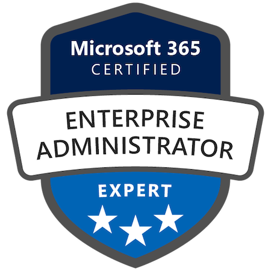
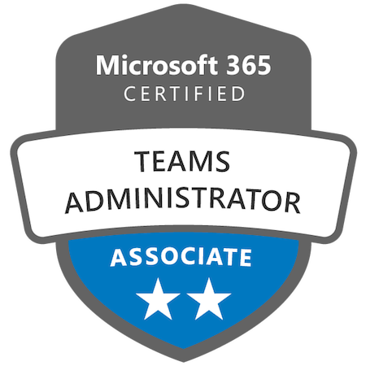
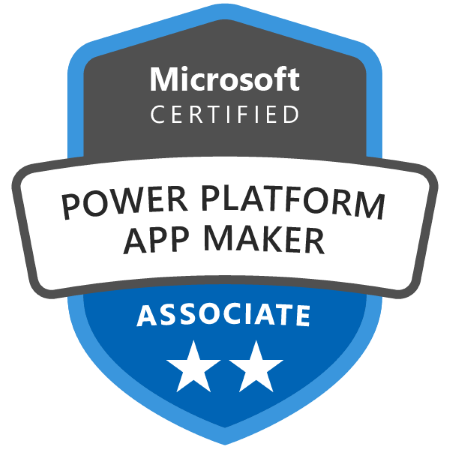

I completed a Bachelor of Computing Honours from [Queen's University](https://queensu.ca) in Kingston, Ontario, Canada, with a specialization in Cognitive Science.

I have also obtained some Microsoft 365 certifications:

## Microsoft 365 Certified: Enterprise Administrator Expert

## Microsoft 365 Certified: Teams Administrator Associate

## Microsoft Certified: Power Platform App Maker Associate

## Microsoft Certified: Information Protection Administrator Associate

