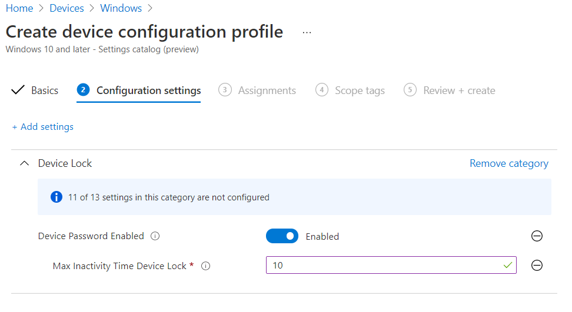

In episode 3 of [The Flight Attendant (HBO Max)](https://www.imdb.com/title/tt7569576/?ref_=fn_al_tt_1), Megan agrees to do some corporate espionage against her husband’s large company. It isn’t clear what the company is – maybe it will explain as the story continues in later episodes – but it is clear that he has access to some significant trade secrets. So Megan encourages her husband to bring his laptop home, then casually finds the file and copies it to a jump drive.

Two things immediately stood out to me as problems with this scene from a basic IT security perspective.

## The Computer Password

This is one that I catch a lot in movies and TV. Why could she just open her husband’s work laptop and be logged in, no password needed? It’s possible there’s some simple user error here, where her husband was just on the computer and didn’t bother to lock it in his own house when he walked away.

That is understandable, but given how important these trade secrets of a large company are, I would have thought there would be some stronger policies enforced on the machine. With Microsoft Endpoint Manager (and probably similar in other device management systems), the IT Administrator for this big company with important secrets could force the device to lock after x minutes of inactivity, as low as 1 minute. It could be paired with Windows Hello for Business – a fingerprint reader or infrared camera – so that he could still get in quickly each time it locked, but nobody else could. If this policy was set, Megan would have had to act fast to get in, even when her husband was careless about locking.

Windows 10 also has options like Dynamic Lock, which will automatically lock the computer when a paired Bluetooth device (most likely a phone) is out of range. There may not be an option in Microsoft Endpoint Manager to force that, though, and would require the user to do the Bluetooth pairing.

Of course none of this matters if Megan’s husband intentionally let her in, but there’s a lot the IT Admins can go to almost eliminate scenarios like her breaking in without his help.

## Information Protection

Ok, so let’s assume that Megan has successfully gotten into the computer and found the file. Maybe her husband intentionally let her in. Maybe he was a little sloppy and either it didn’t have adequate protections or she was fast. That still leaves another problem: she still shouldn’t be able to copy it out to a jump drive.

This can be prevented with [Azure Information Protection](https://azure.microsoft.com/en-ca/services/information-protection/) (again, it is possible that similar products from other providers offer the same idea). If this file is as sensitive as the context of the show suggests, it should be tagged with an appropriate protection policy, which can define things like not being allowed to copy it. If that was enabled, Megan would not have simply been able to copy sensitive data onto a USB drive.

Of course responsible IT policy wouldn’t make very good TV. In this case, this subplot would hit a dead-end quickly if Megan couldn’t steal a file that was properly protected. But in the real world, if you’re dealing with sensitive data, you should be using every tool at your disposal to keep it from being stolen.
