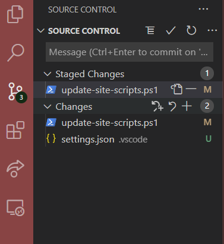

Working in Visual Studio Code but need that connected to your GitHub repository? No problem. Getting connected to GitHub from Visual Studio Code is straightforward. It’s also possible to connect to other Git servers, but the authentication process is a bit more complicated, so I’ll stick to [GitHub which is now my primary code repository](https://github.com/ryan-l-robinson). I’m also sticking with Windows, but the general idea is the same for other platforms with Code.

## Configuration

To get started:

1. Install [Git for Windows](https://git-scm.com/download/win).
2. Open Visual Studio Code in the repository of your code.
3. Click on the Source Control icon in the left menu.
4. Follow the prompts to connect to your GitHub account by authenticating in your browser.
5. Once that is done, the Source Control tab will now give you a couple of options, to either Initialize Repository (set up the source control on the folder but without connecting to GitHub) or Publish to GitHub (set up the source control on the folder and connect to GitHub). Select Publish to GitHub.
6. The toolbar at the top will offer you the choice to change the name of the repository as well to make either a private or public repository. Choose which one makes more sense for your context.
7. Finally, it will ask you which files from the folder to add to the repository. Unselect any that you don’t want to commit and continue.

That’s it. It’s a pretty intuitive process even if you are brand new to GitHub.

Once it’s set up, you get a few useful features:

## Visual Cues

The most valuable component to me is the visual cues of changes. It’s like having a constant diff between your current version and the last commit. If you add a line, that line will be marked green in the sidebar. If you change a line, that line will be marked blue in the sidebar. If you delete a line, there will be a little red arrow where it was.

Clicking on the area of those colour indicators will pop up a full diff of the changed section. That will also include quick options like reverting all changes on that section.

## Commit and Push

Your standard git workflow actions can all be done from the Source Control section in the sidebar. It will show you everything that has changed since the last commit, with options to open the file, discard changes, or stage the file for the next commit. Above the file list you can enter your commit message and hit the checkmark to commit. Other actions like pushing and pulling are tucked away in the ellipses overflow menu.

You still have to understand the basics of what is involved in git source control, but you don’t have to memorize the commands for each step. Everything is available visually.

## GitLens

The extension [GitLens](https://marketplace.visualstudio.com/items?itemName=eamodio.gitlens) adds a few more useful features and is worth adding. Among other things, it will give you blame lines that shows who last changed a line, when, and as part of what commit.

