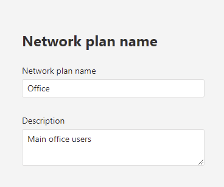
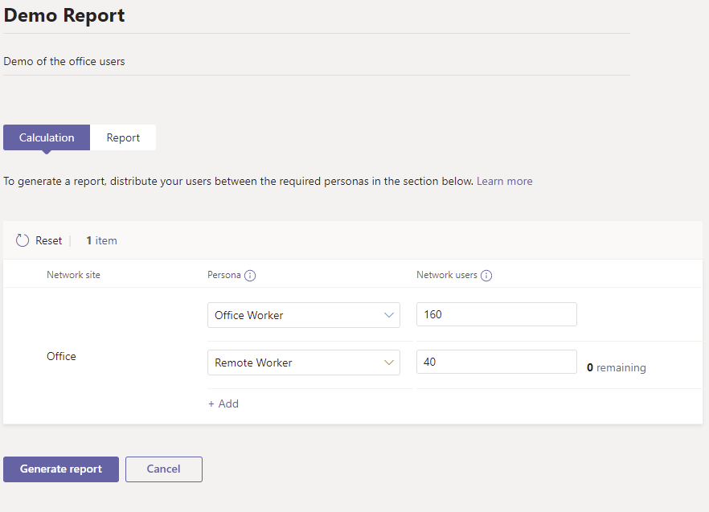

If you’re going to deploy Microsoft Teams in your business network, you’ll need to confirm first that your network can handle it. That means fast enough bandwidth speeds to handle everything you want all of your employees to be able to do, as well as having all the ports open for the necessary traffic to get through. If you’re going to need hundreds of users on the same network sharing their screens alongside their video and audio in meetings of 50 people, that will eat up a lot of network resources.

Microsoft has offered a few tools to help with this preparation.

## Required Bandwidth

Here’s the guidance from Microsoft for speeds required to use Teams well:

- Peer-to-peer audio: 30 Kbps (approximately dial-up Internet)
- Peer-to-peer audio + screen-sharing: 130 Kbps
- Peer-to-peer 360p video calls: 500 Kbps
- Peer-to-peer 720p HD video calls: 1.2 Mbps
- Peer-to-peer 1080p HD video calls: 1.5 Mbps
- Group video calls: 500 Kbps / 1 Mbps
- HD group video calls on a 1080p screen: 1 Mbps / 2 Mbps

Most home high-speed Internet living in a city will be fast enough to cover a few people on a call at once pretty comfortably. But that might get a bit more complicated when you’re dealing with large numbers of people in a single office.

## Network Planner and Network Testing Companion

Network Planner is a tool in the [Teams Admin Centre](https://admin.teams.microsoft.com/) that helps you determine just how fast of network you need to support all your users. You enter details about how much you think you’ll need to use Teams and it will calculate for you what bandwidth you need.

Start out by selecting Network Planner from the menu. First, check the personas. These are the different types of users and what you expect they will need. Check the default ones to see if they meet your needs, or add more custom ones if the defaults don’t.

Then select to add a new network plan and name the plan.

Then select that plan, and specify all of the locations this plan includes (all your offices / remote users).

Now you’re ready to run a report to see the results. Click to add a new report. You’ll be asked how many users you have of each persona.

After you generate the report, it will tell you exactly what speeds you need for that many users to carry out the needed tasks.

A related tool is the Network Testing Companion. This is an app that can be run on your PC to test out your network’s configuration and tell you things like what ports need to be opened.

## QoS

Quality of Service configuration is a tool that allows you to prioritize certain traffic if you’re pushing the limits of your network. Generally speaking, if you’re on a video call with audio, it is more important that the audio gets through than the video. QoS can help make sure the audio gets through even if the video doesn’t.
