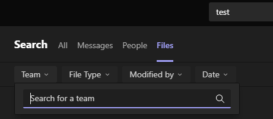

I recently was asked whether it is possible to search in Microsoft Teams for a file but only within a specific site. The short answer is yes, but that’s not the default search behaviour. When you use the search bar in Teams, it will default to all types of results across all Teams you are a member of. But then you can filter from there. This is significantly improved by [some recent changes](https://techcommunity.microsoft.com/t5/microsoft-teams-blog/new-and-improved-search-results-experience-on-microsoft-teams/ba-p/3035064).

So, if I know I am looking for a particular file in a particular Team, I can do that this way:

## Teams

Start the search in the usual way by typing your search term in the search bar at the top of Teams. By default you’ll see all types of results from all Teams, and it might not be obvious that you have more filter options than the basic content type filters. But, once you click on those, you’ll get more filters specific to that type of content. For the example of Files, you’ll see the ability to filter by Team, File Type, Modified by, and Date.

For the example scenario originally asked of me, the goal would be achieved by using the Team filter.

In other words, Teams search starts at universal, then provides filters to help you get more specific.

## SharePoint

By comparison, SharePoint search behaves a bit differently. When you are on a particular site other than the Home site, it will default scope to only that site and others in the same hub, even if you are a part of other sites. Then you have filters to expand. It’s essentially the opposite direction. It can assume based on the current site that you are looking for content on that site.

This difference makes sense, as the Teams search bar stays in the same place no matter what you are currently viewing. There isn’t an easy way for Teams to know in advance which Team you want to search. So it makes sense to start at everything and move backwards, while SharePoint can start specific and allow you to move outward.
