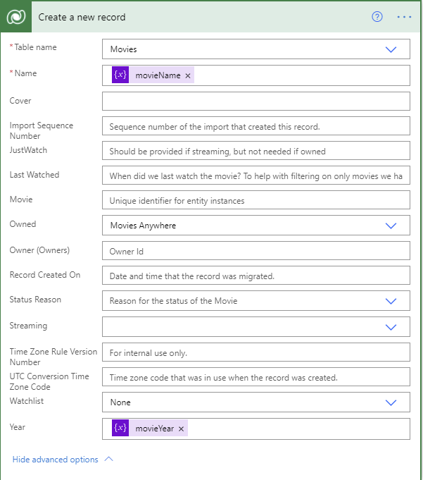
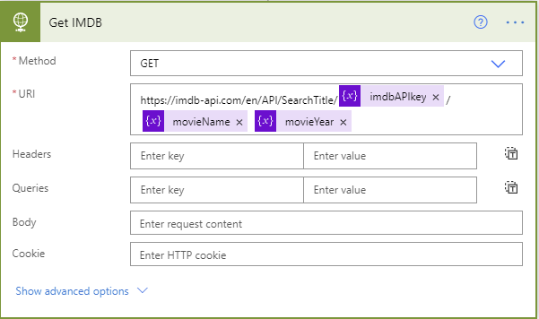

This continues a short series about [a movie directory personal project](/tags/movie-directory/) exploring Power Apps and Dataverse. In the first three posts, I’ve laid out the data structure in Dataverse and the app itself. This post will tackle how I was able to quickly fill in the 300+ movies in our collection converting from our previous system, files on a computer arranged for use on a Plex server. This will all be done in Power Automate.

## The Old Structure

Here’s how the old structure was, to work nicely with a [Plex](https://www.plex.tv/) server:

- There was a folder in my OneDrive differentiating where we owned each movie. Some movies were only on disc. Others were in one or more digital stores as well. As I tried to get more and more digital copies of movies we already owned, I would move a file from the general Movies folder into the correct digital store folder. This wasn’t a complete system, though. For example, it didn’t differentiate Blu-ray vs DVD, and if I had something in both Google and Microsoft it would only be in the Google folder.
- Every file was named in the format “Movie Title (Year).” The year is valuable in Plex to help differentiate if there are multiple movies with the same title.

## The Variables

To start the Flow, I declared several variables:

- ownedPlatform: will come from what folder it was in
- fileName
- movieName: parsed from the file name
- movieYear: parsed from the file name
- yearStartIndex: to help with the parsing
- imdbAPIkey: my API key for IMDB, which I will use for grabbing cover images

## Get the Movies

First I’ll get all the movies. This is straightforward with a OneDrive “get files” action. I did find that I could only do a certain number of files at once, so I did it in chunks by having a separate “To Copy” folder, in which I put the next batch as I needed to copy them.

I’ll then enter a loop of all the results, handling one movie at a time. This is a simple Apply to Each loop using the “value” from the previous step’s results.

## Parse Name and Year

Start by grabbing the file name and putting it into the variable:

To parse the fileName, I needed to find where the movie name ends and the year begins. The easy way to do that is to look for the last instance of a closing parenthesis.

That will make it easy to get the movie name and year.

## Add to Excel

I’ll now add details for the movie into Dataverse. I also had some checking to confirm that the movie wasn’t already in the Dataverse table, but I’ll skip those details.

Of note here:

- The Name and Year are filled by the variables we parsed from the file name earlier.
- The Owned dropdown is determined by the folder the file was in. In my case I just changed this manually between running it against each folder.

## IMDB API

I’ll now use the IMDB API to get the cover image for the movie, which I’ll upload to my OneDrive to make it easier to attach them to the right Dataverse object. I likely could have gotten as far as it automatically uploading the image directly into Dataverse with a premium subscription, but I didn’t have that and didn’t find a way around it in a reasonable amount of time.

Part of what that returns is a URL to the cover image for the movie. I’ll now upload that file into a designated folder in OneDrive.

!["Source URL: body(‘Get\_IMDB’)?\[‘results’\]\[0\]\[‘Image’\]"](./upload-cover-onedrive.png)

## Conclusion

There were still some pieces I had to do manually, like attach the image to each movie, but even that was a much quicker process.

In a different Flow, I also added some logic that guessed whether a movie was Blu-ray, DVD, or digital only based on the size of the file. That wasn’t very complicated, but I left it out of this version as I found I often needed to clean up the owned column anyway because of the number of other exceptions (a movie in both Google and Microsoft).

Ultimately, I ended up not actually using this movie directory database app. The main reason was that it was too slow. It is not equivalent in performance to a native Android app. But it was a great test, achieving all the features I wanted to do, and I definitely learned a lot more about Dataverse, Power Apps, and Power Automate along the way.
