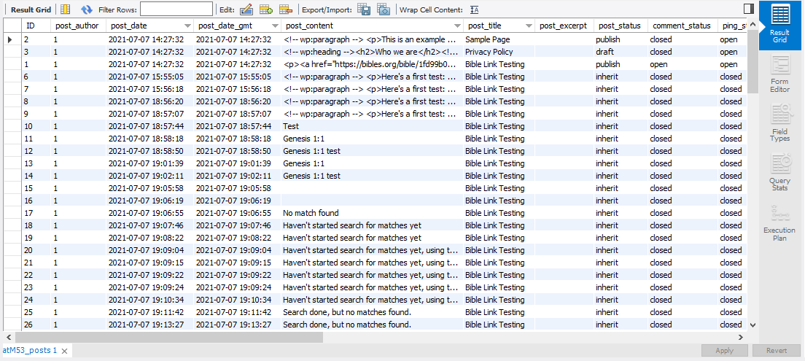
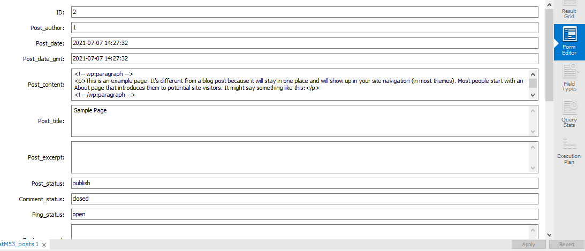

You know what desktop app made the largest improvement to my workflows when I discovered it? Not [Visual Studio Code](/tags/visual-studio-code/), as much as my writing sometimes hypes it up as my preferred text editor. There were already good text editors.

No, the desktop tool that made the biggest improvement to my workflows was [MySQL Workbench](https://www.mysql.com/products/workbench/). If you work with MySQL databases at all, this will make your life so much easier than navigating those databases in a command line.

## Advantages

It is much easier and more user-friendly to browse a database. You can see all the tables in a database along the side panel and clicking on one inserts it into a query, avoiding typos copying it. When you run a SELECT command and get lots of results in a terminal, it often doesn’t stay lined up very well. It’s virtually impossible to read large data sets not lined up. But in Workbench, everything stays perfectly in its columns.

Along the same lines, it is a lot easier to apply sorting by a column, by clicking on the headers in the results. This can be faster than writing out the query.

If you want to edit a particular record from the results you’re viewing, all you need to do is hit the Form Editor option beside the results. You only need to worry about writing UPDATE queries when making bulk edits.

You still need to know enough MySQL to write many types of queries, but an added bonus is that it provides syntax checking. If you know a bit but aren’t an expert in writing MySQL queries, this can be a big help.

You can have multiple sites/databases saved to quickly switch between. You can also have multiple query tabs to jump back and forth between, which can be quite helpful when investigating several tables at once.

Finally, MySQL Workbench includes a variety of features such as importing from csv and exporting to csv. That pair of features can be great if you need to migrate to another system with some data cleanup in between.

## Download

You can [download MySQL Workbench for free](https://www.mysql.com/products/workbench/). It will prompt you to create an account, but there is also a link to download without an account if you’d prefer.
