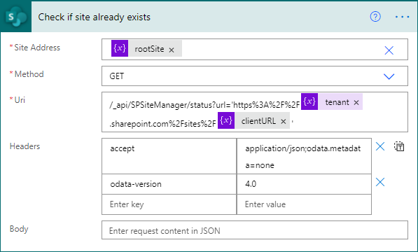
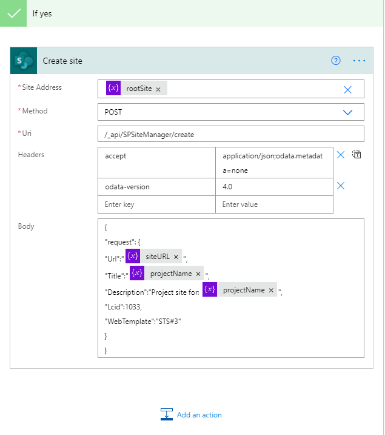

This post continues a series on [SharePoint site provisioning](/tags/sharepoint-site-provisioning/), unpacking some of the problems I’ve faced and overcome in building SharePoint site provisioning solutions.

This post will look at dynamically creating SharePoint sites using Power Automate. An advantage of doing it this way is to automate different settings that can incorporate variables, as opposed to the standard interface tools for users to create new sites.

## Check if Site Already Exists

This can be done with [the SharePoint REST API](https://docs.microsoft.com/en-us/sharepoint/dev/apis/site-creation-rest) if you want just a SharePoint site, or a new Group if you want all of the Group functionality (Teams, Planner, etc.). For this example, I’ll use the former.

You will likely want some error checking, specifically to see if the site already exists at the requested URL. There could be a few ways to handle what to do if there is a conflict, depending on your context. Maybe you want to stop and send an email to notify the user of the issue. Maybe you want to assign a different URL and create a new site. Or you could allow it to update the existing site. For this demo, I’ll go with the last one. That makes my logic pretty simple: if site doesn’t exist, make it.

I’ll use the Get Site API call to see if the site already exists.



Details:

- Action type: Send an HTTP Request to SharePoint
- Site Address: the root site, or another site that you know already exists
- Method: GET
- URI: /\_api/SPSiteManager/status?url=’https%3A%2F%2F@{variables(‘tenant’)}.sharepoint.com%2Fsites%2F@{variables(‘projectURL’)}’
- Header 1 key: accept
- Header 1 value: application/json;odata.metadata=none
- Header 2 key: odata-version
- Header 2 value: 4.0

Part of what that returns is a SiteStatus value. A value of 0 means that it hasn’t been created yet. A value of 2 means it has. There are also two less common responses: 1 means it is currently being provisioned and 3 means there was an error provisioning the site.

In a more intensive real situation, I would also want to deal with those less common scenarios. But for this example, I’ll stay simple and just say that if it is 0, go ahead and make the site.

Here’s the condition statement:


Details:

- First piece of equation: int(body(‘Check_if_site_already_exists’)?\[‘SiteStatus’\])
- Boolean test: is equal to
- Second piece of equation: 0

## Create Site

We’re ready to create the site, which can also be done with REST API calls.



Details:

- Site address: root site, or some other site you already know exists
- Method: POST
- Uri: /\_api/SPSiteManager/create
- Header 1 key: accept
- Header 1 value: application/json;odata.metadata=none
- Header 2 key: odata-version
- Header 2 value: 4.0
- Body:

````json
"request": {
"Url":"@{variables('siteURL')}",
"Title":"@{variables('projectName')}",
"Description":"Project site for: @{variables('projectName')}",
"Lcid":1033,
"WebTemplate":"STS#3"
}
````

You can customize details from here, like adding error checking for the other site statuses, added an owner to the site you create, changing the template of the site, and so on.

The next post in this series will work on adding temporary site scripts and designs for the new site.
