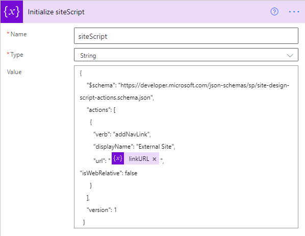
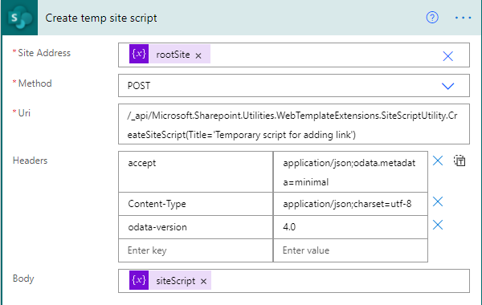
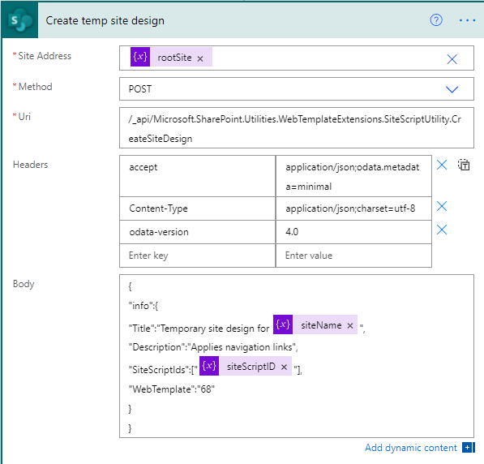
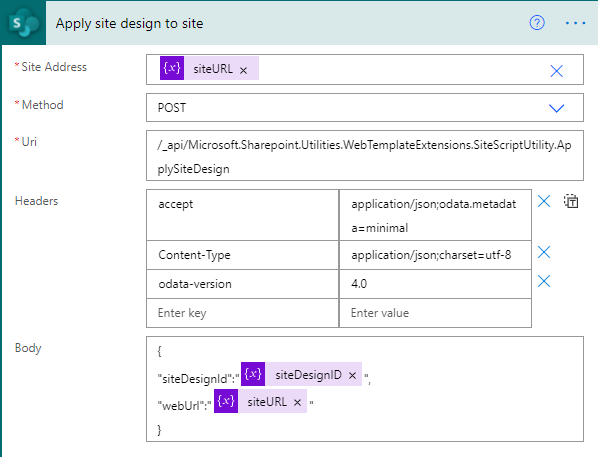
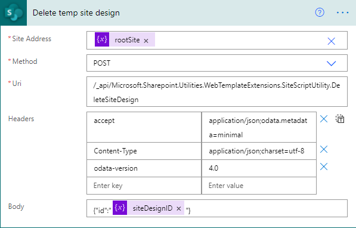

This post continues a series on [SharePoint site provisioning](/tags/sharepoint-site-provisioning/), unpacking some of the problems I’ve faced and overcome in building SharePoint site provisioning solutions.

[In the last post in this series](/posts/2021/power-automate-create-site-with-sharepoint-rest-api/), I created a SharePoint site programmatically. Suppose you want to update site scripts or site designs onto that new site. The advantage of doing this is that it can be fully automated based on another causal event setting it off, like filling out a Power App or creating an item in a SharePoint list, and incorporate variables. My simple example will use a variable of a link that will be added to the navigation of this new site.

## Write the Temporary Script

Prepare your SharePoint site script, but leave a gap for the part where you need to put the variable. I recommend doing this in a separate code editor and saving the file. That makes it easier to roll back any changes and to detect syntax errors like a missing \]. Editing code directly in Power Automate can get messy.

Once your script is ready, add that to a new Initialize Variable action in Power Automate, setting up a new string variable for the entire script. Within that script, you can insert any other variables you need to. Here’s my simple script:



Details:

- Action: Initialize Variable
- Name: siteScript
- Type: String
- Value:

```json
{
    "$schema": "https://developer.microsoft.com/json-schemas/sp/site-design-script-actions.schema.json",
    "actions": [
      {
        "verb": "addNavLink",
        "displayName": "External Site",
        "url": "@{variables('linkURL')}",
"isWebRelative": false
      }
    ],
    "version": 1
  }
```

## Register the Temporary Script

Now that you’ve got the script written, complete with variable, you can use the SharePoint REST API action to register that site script on your SharePoint instance.



Details:

- Action: Send an HTTP Request to SharePoint
- Site Address: root site, or some other site on the tenant you know already exists
- Method: POST
- Uri: /\_api/Microsoft.Sharepoint.Utilities.WebTemplateExtensions.SiteScriptUtility.CreateSiteScript(Title=’Temporary script for adding link’)
- Header 1 key: accept
- Header 1 value: application/json;odata.metadata=minimal
- Header 2 key: Content-Type
- Header 2 value: application/json;charset=utf-8
- Header 3 key: odata-version
- Header 3 value: 4.0

I also created a variable to capture the ID of the site script that was just created. You could do without this step, instead referencing back to the body of the response every time you need it, but it is easier to keep track of with a variable.


Details:

- Action: Initialize Variable
- Name: siteScriptID
- Type: String
- Value: body(‘Create\_temp\_site\_script’)?\[‘Id’\]

## Create the Temporary Design

Once you have a site script, you can now do essentially the same thing with registering a temporary site design that uses that script.



Details:

- Action: Send an HTTP Request to SharePoint
- Site Address: root site, or another site on the tenant you know exists
- Uri: /\_api/Microsoft.SharePoint.Utilities.WebTemplateExtensions.SiteScriptUtility.CreateSiteDesign
- Headers: \[same as registering the site script above\]
- Body:

```json
{
"info":{
"Title":"Temporary site design for @{variables('siteName')}",
"Description":"Applies navigation links",
"SiteScriptIds":["@{variables('siteScriptID')}"],
"WebTemplate":"68"
}
}
```

Note that WebTemplate 68 is a communication site. 64 would be a team site.

As with site scripts, I want to grab the ID into a variable to make it a bit easier to reference in future actions.


Details:

- Action: Initialize Variable
- Name: siteDesignID
- Type: String
- Value: body(‘Create\_temp\_site\_design’)?\[‘Id’\]

## Delay

You may want a bit of a delay before applying the site design. This is to ensure that the site does already exist before you try to apply the design. Rather than guessing a specific amount of time for the site to be prepared (5 minutes has always been sufficient in my tests), you could also use a test to see if the site exists yet with a REST API call like the one above. In that case you could put that within a loop:

1. Enter loop only if site does not exist.
2. In loop, delay one minute, then check if site exists yet.

That could result in small gains on average compared to always delaying 5 minutes. For this demo I stuck with simply delaying 5 minutes.


You also may need to delay much longer if your site scripts rely on [global content types](/posts/2021/sharepoint-content-types/). Those content types won’t be available on the site immediately. They could be up to 90 minutes in my tests. If you are using content types, you may want to do only a 3 or 5 minute delay now, apply one design that does most of what you want, then delay another 90 minutes before applying another design that handles those components. That way the site is at least partially usable in that 90 minute wait.

## Apply the site design

Yet another REST API call will allow you to apply the site design that is now registered.



Details:

- Action: Send an HTTP Request to SharePoint
- Site Address: the new project site’s URL
- Uri: /\_api/Microsoft.Sharepoint.Utilities.WebTemplateExtensions.SiteScriptUtility.ApplySiteDesign
- Headers: \[same as registering the site script above\]
- Body:

```json
{
"siteDesignId":"@{variables('siteDesignID')}",
"webUrl":"@{variables('siteURL')}"
}
```

## Clean Up

You don’t want to leave a script and design every time this runs, so you’ll want the Flow to delete those temporary scripts. This can also be done with SharePoint REST calls. First remove the design, then the script, since the design depends on the script.



Details:

- Action: Send an HTTP Request to SharePoint
- Site Address: the root site, or another site on tenant you know exists
- Uri: /\_api/Microsoft.Sharepoint.Utilities.WebTemplateExtensions.SiteScriptUtility.DeleteSiteDesign
- Headers: \[same as registering the site script above\]
- Body:

```json
{"id":"@{variables('siteDesignID')}"}
```


Details:

- Action: Send an HTTP Request to SharePoint
- Site Address: the root site, or another site on tenant you know exists
- Uri: /\_api/Microsoft.Sharepoint.Utilities.WebTemplateExtensions.SiteScriptUtility.DeleteSiteScript
- Headers: \[same as registering the site script above\]
- Body:

```json
{"id":"@{variables('siteScriptID')}"}
```

That’s it: you now have a Flow that generates temporary site scripts and designs, applies them, and then cleans up afterward.
