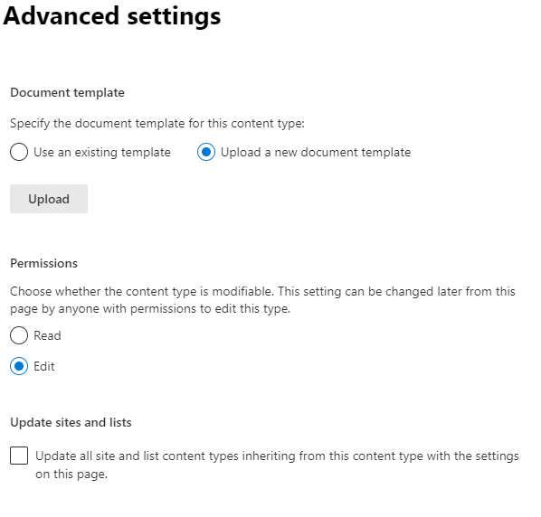

Content types are one of those features of SharePoint where you can be using SharePoint for years and never notice is there. They often aren’t an absolute necessity. But they do make some things much easier. The average user may not need to be familiar with them, but administrators should be.

There are two major advantages to using content types: a standardized set of columns (metadata) and file templates.

## Columns

Columns in SharePoint are metadata about a file or about a list item. These can be of a variety of data types including yes/no fields, dropdown option lists, short text, long text, and more. The easy way to remember why they’re called columns is to imagine them in the most common view, with one row in a table for each item and a column in the table for each piece of data about that item. Once they’re all set up, columns can make a lot of things easier including seeing relevant data at a glance, searching for, sorting, and filtering the content.

Now suppose you have 20 custom SharePoint lists that are fundamentally the same idea. Perhaps they had to be split to exist on different sites with different permissions, or perhaps they had to be split to keep each list under the 5000 limit threshold where viewing a list gets limited. They should all have the same 30 custom columns of data that needs to be tracked.

Without content types, the way to do this is to repeat the process creating a column on every list separately. That’s already annoying. It gets even more annoying if you have to make a change – perhaps you realize a certain column should be long text instead of short text – and go through all 20 lists again. What if you make a mistake and name the column differently on one of the 20 lists but there’s already data in it by the time you notice? That might throw off other pieces like Power Automate processes.

With content types, it gets much easier and much less error-prone. You define the columns on the content type in one place, either specific to one site or globally for all sites, and add the content types to the list/library. If globally, it can take a couple of hours to propagate to all of the lists, but that’s it. That’s the whole process.

Most of the time the instinct with a new list or library is to add the columns directly to that list or library and completely ignore content types. That’s fine if you know if you’re never going to need the same column set on another list. But if there’s any chance you will need it again, save yourself a lot of hassle and make it a content type in the first place.

## Templates

The other big selling point of content types is specific to file libraries (not lists). Suppose you have a company template that all of your press release statements start from (company letterhead, etc.).

Without content types with templates, your process may look something like this:

- Keep the template starting point file in a SharePoint site where only those who need it can see it.
- Every time somebody needs it, they go find that file and make a copy of it into the new location where they need a new one.
- They are then free to edit the copied version.

At best this is slow, with time needed to copy the template every time. At worst, it introduces other problems: can you adequately control who can edit the template file? what if somebody accidentally starts editing the template instead of making a new copy, an easy mistake to make?

With a content type, this gets much cleaner. Add the template file to the content type. Then when somebody tries to make a new item of that content type, it will start with the templated file instead of a blank document. They can edit the file from there. It’s fast and intuitive, access to editing the template is tightly controlled, and there’s no risk of somebody forgetting to copy before they dive in to edit.

## SharePoint Syntex

I’ll add a third point. [SharePoint Syntex](https://docs.microsoft.com/en-us/microsoft-365/contentunderstanding/#get-started) is a relatively new product offering that uses machine learning to read data from files and apply that to the columns. It’s a valuable way to help automate applying metadata to files, which is something that people tend to not enjoy doing manually. I have not extensively tested out SharePoint Syntex, but it is my understanding that the machine learning models are applied on specific content types. If you want to use this tool you’ll end up using content types whether you realize it or not.
