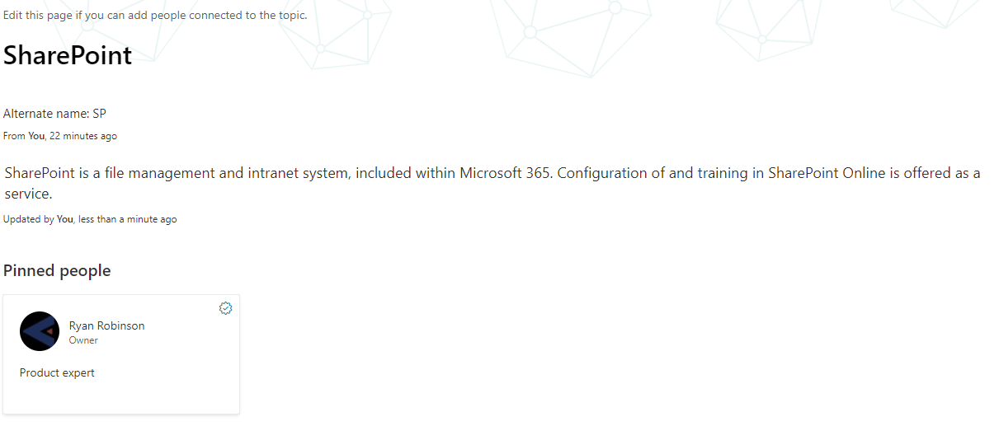
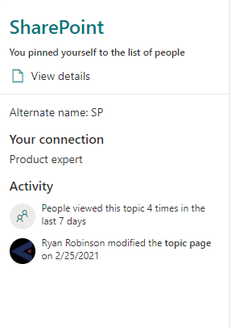

In [my previous post](/posts/2021/viva-topics-configuration/), I walked through my thoughts on the configuration process for the new Microsoft Viva Topics functionality within Microsoft 365. In this post I’ll dive into what the experience is like for users once it is configured.

## Creating / Editing a Topic

You can edit a topic page similar to editing any other SharePoint page, but there is a lot less flexibility. It has a predefined set of features and you cannot add other web parts.

- **Title**
- **Alternate names**: this allows for the topic being surfaced for alternate names, not just the core title. A suggestion here is to add any acronyms for the topic that you’re likely to use in normal conversation.
- **Short description**: a bit of text to summarize the topic.
- **Pinned people**: identify users in the organization who are relevant to the topic, with a title for how they are related, such as “topic expert.”
- **Pinned files and pages**: if there are files and pages on other SharePoint sites that are particularly important to this topic, you can pin them here for easy access.
- **Related sites**: similar idea, but for SharePoint sites.
- **Related topics**: links to other topics, visualized in a way to help you see how all your topics connect to each other.

## Surfacing Topics

Currently the surfacing of topics for users is limited to only SharePoint pages. When you hover over the linked topic title, you see a hover card very similar to what you see when a person is referenced.

This should expand over time to also show up in other Microsoft 365 resources, such as in emails and Teams conversations. It’s moderately useful now, but once it also starts showing up in this more organic contexts for conversation, that will be a huge additional value.

## Use Cases

A few scenarios come to mind where this topic functionality could be great.

If you are a client-oriented business, you could use a topic as a landing page for each client. Alternate names could be acronyms or shortened versions of the client’s name. Pinned people could be an account manager or project manager who often works with the client. Related files may be the most important files for the client, such as a contract, and related sites may be other SharePoint sites in your system that contain data like a project’s files.

A product or service oriented business could be similar, with a topic card for your major products. Pinned people would be the experts on that product.

Internal documentation would also work as topics. The detailed steps would need to be files that are held elsewhere, but they can be linked from the topic card. For example, if you offer Drupal website consulting, you may have detailed documentation on the SharePoint site for the team responsible for Drupal website consulting. Then you create a Drupal topic card, which has links out to the detailed documentation.

In all of these scenarios, there is clear value to being in the middle of a SharePoint page (or later, a conversation) where a topic is referenced and you are able to quickly get to more information about that topic through a pop-up card.

## Conclusion

Note that my tests are missing one of the most compelling aspects of Viva Topics: the automatic creation and updating of topics pages. My tenant consisting of just me doesn’t have nearly the scale to easily manufacture that test. All of my tests relied on manually creating topic pages.

With that gap in testing acknowledged, even if the automatic component isn’t as strong as promised, I really like Viva Topics. The idea of being able to surface important topics in other places through Microsoft 365 promises a pleasant user experience that saves a lot of time in accessing important information.
