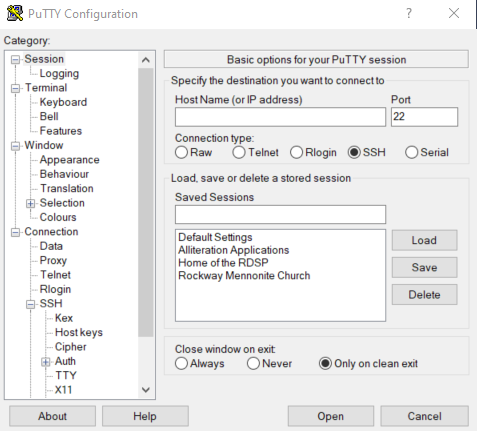

When I work on a freelance website (I have more advanced tools in my day job), especially once I need to deploy some custom code, I have several tools at my disposal I want to set up. Here’s what those tools and that setup process looks like. For the purpose of this post, I’m assuming I already have the SFTP and SSH credentials from the website host.

## SSH Keys

The one-time need is to prepare my SSH keys. This requires three files which can be created with PuTTYgen, part of the package that comes with PuTTY.

1. Create your SSH key using the “Generate” button, if you don’t already have one you could load.
2. Save the private key file using the “Save private key” button. It is often recommended to put this in a folder called .ssh in your user directory, but at least for my purposes it can be anywhere.
3. Create a file named “id_rsa.pub”. Copy the text at the top of the PuTTYgen window and paste it into that file using a code editor and save.
4. Use the “Conversions” -&gt; “Export OpenSSH key (force new file format)” option in the menu. Save that file as “id_rsa” (without the .pub extension).


The file created by step 2 will be used in PuTTY. The file created in step 3 will be added to each site’s authorized_keys file as well as GitHub. The file created in step 4 will be used by Visual Studio Code.

## PuTTY

PuTTY’s piece of the puzzle is to provide SSH access for executing shell commands on the site. This may not be necessary if you can use the integrated terminal in Visual Studio Code, but the host I use does not allow that due to security restrictions.

Before adding any specific site, I want to change a couple of settings for the default configuration to aid in using the SSH key for authentication. In the sidebar menu, select Connection -&gt; SSH -&gt; Auth, then:

1. Check the box for “Allow agent forwarding.” This is necessary to use the same SSH key to authenticate to GitHub.
2. Under “Private key file for authentication” click the Browse button and navigate to the private key file.

Then go back to the top settings option, select “Default Settings” and “Save” to overwrite the defaults.



When it’s time to add a new site, there’s little configuration needed:

1. In the “Host Name” field, enter &lt;username&gt;@&lt;hostname&gt;.
2. Enter a new title under “Saved Sessions.”
3. Click “Save.”

In the future when I want to open it, I simply double-click on the saved session.

## Authorized_keys

If you’ve done the first part and try to load up a site, you will get prompted for the password. That’s because the web server hasn’t been told it’s safe to authorize with that SSH key yet. To do that, update the file at ~/.ssh/authorized_keys to contain a line with the contents of id_rsa.pub file. You can have multiple lines in authorized_keys if there are more people working on the site.

There are lots of approaches to updating that file (cPanel, SFTP, etc.), but I usually do it by connecting first with PuTTY (using a password the first time) and then editing the file with vi:

```bash
mkdir .ssh
vi .ssh/authorized_keys
i #enters insert mode
#paste the contents of your id_rsa.pub by right-clicking
#esc key to exit insert mode
:wq! #saves and exits vi
chmod 700 .ssh
chmod 700 authorized_keys #limits access to this file
```

I then close the session in PuTTY and try opening the saved session again. It should be able to connect and only need the SSH key password, not the site user password.

When I first tried this, it also worked to allow me to push from the server to GitHub. That stopped working when I came back a few months later, though. So here’s what I also had to do:

1. Upload the id_rsa file to the .ssh folder
2. Assign it restricted permissions and then add the key

```bash
chmod 700 ~/.ssh/id_rsa
ssh-add ~/.ssh/id_rsa
```

## GitHub

Any code that I want to customize unique to this site, not just using available plugins and themes published elsewhere, I want to commit my code to GitHub.

Here’s a common scenario for me: I’ve created a child theme to apply some tweaks to a published theme elsewhere. When a core theme gets updated, that can create conflicts, so I usually want to see specifically what files got updated. If that includes any of the files I overrode in my child theme, I want to know that. Then I can look at the specific lines that have been changed, and copy those changes if necessary into my child theme.

Here are the commands for me to configure the git repository, using the themes folder as the example:

```bash
cd ~/public_html/wp-content/themes
git init
git add *
git branch -M main
git remote add origin [SSH path to repository]
git push -u origin main
```

It is important that you use the SSH path to the repository, not the HTTPS path. You’ll need it to be using the SSH path to be able to forward your SSH key using PuTTY to connect to GitHub. Note that it is possible to initialize the GitHub repository all in Visual Studio Code, but it does default to using the HTTPS path instead of SSH, so doing it that way means you’d have to change the .git/config file later.

## Visual Studio Code

[Visual Studio Code](https://code.visualstudio.com/) is my code editor of choice, so this is an essential piece of the puzzle if I am doing any customizations to the site. I’ve written more about Visual Studio Code in the past:

1. [Remote SSH in Visual Studio Code.](/posts/2021/vs-code-remote-ssh-development/)
2. [GitHub in Visual Studio Code.](/posts/2021/github-visual-studio-code/)

When I have a new site to add, I do this:

1. Click on the Remote SSH icon in the left menu.
2. Scroll over the “SSH Targets” header so the little gear icon appears and click on that.
3. It should pop up offering different locations of SSH config files on your computer. Select the relevant one.
4. Add a new section to the file using the format below. I like to organize them alphabetically and use the URL of the site for the host name.

```plain
Host [URL]
  HostName [URL]
  User [SSH username]
  IdentityFile [Path to id_rsa file]
  ForwardAgent yes
```

Refresh the list of SSH targets in the remote explorer so the new URL will appear. Click on the “Connect to Host in New Window” icon beside the new URL. Enter the SSH key passphrase to connect. Click on the file browser icon in the left menu and select “Open Folder.” Browse to the root location of the site that you want to work from. Once you’ve opened a specific folder, you can jump straight to that folder from the SSH Targets list.

## FileZilla

[FileZilla](https://filezilla-project.org/) is a great tool for SFTP access to a website. I don’t need this too often, but it can come in handy if I have to transfer files from my computer to the web server or vice versa. This is all done in the interface.

1. Click on the Site Manager link in the top left.
2. Click the New Site button.
3. Fill in the credentials needed.
4. Click Ok to save, and then Connect to start the connection.

After that, I like to export my list of sites. This will serve as a backup if I need to switch computers: This option is available from File -&gt; Export.
