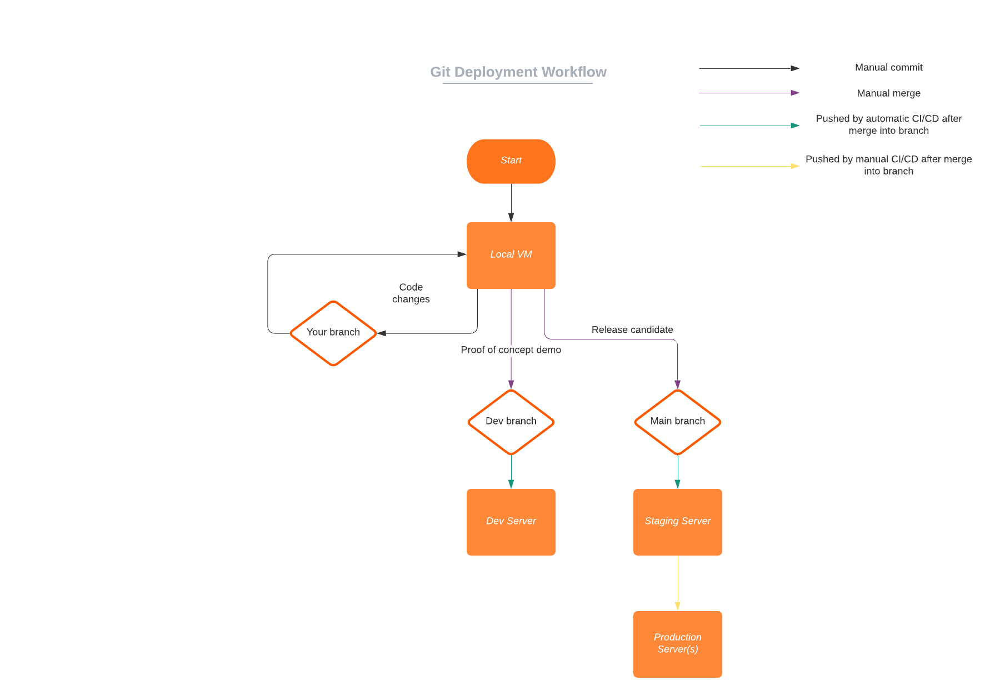

This continues a series setting up a [GitLab DevOps pipeline](/tags/gitlab-devops/) through local virtual machine / container, GitLab, a dev server, a staging server, and a production server. This post assumes you already have a local VM or container, whether that’s through vagrant, Docker Desktop, GitPod, or something else.

## Branch Diagram

This diagram is meant to help explain the flow of code in this system. The development happens in your local branch. When you want to deploy to the dev server, request merging into the dev branch. When you want to deploy to the staging server, request merging into the main branch. There is a CI/CD job for deploying to production as well, but that’s a manual process – not automatic on a branch merge like the other two. The CI files for the deploying will be covered in a later post.



## The Editing and Browsing Workflow

My preferred editor is [Visual Studio Code](/tags/visual-studio-code/). Whether the VM/container is vagrant, [Docker Desktop](/tags/docker/), or [GitPod](/tags/gitpod/), you can use VS Code with it. The best experience is with Docker, then GitPod, and finally vagrant will work but similar to any other server, with no extra special functionality like adding extensions. You could of course also use a different editor / terminal.

Along with being able to edit, this is a website, so it’s pretty important to test out what the website looks like with the current code and database. Exactly what that looks like will depend on whether you’re using a GitPod, a vagrant, or a Docker. I won’t detail all the Apache configuration needed here, since they’ll vary for each system.

They are covered more in the posts about having a Drupal-friendly environment in each of the respective virtualization/containerization systems:

- [Vagrant VM](/posts/2021/vagrant-oracle-linux-vm/)
- [GitPod](/tags/gitpod-drupal/)
- [Docker Desktop](/tags/drupal-docker/)

## Commit to GitLab

In this setup, we’ll have one branch of the GitLab repository for each user. That way each user will not interfere with any work done by other users on other VMs.

To start a new branch and switch to it, I run this:

```bash
git checkout -b ryan
```

To add changes to and then commit to the ryan branch, I run this:

```bash
git add [file to add]
git commit -m "[description of what changed]"
```

## Merge Request

When I think it’s ready to be merged into the main branch, I go into the GitLab interface and put in a merge request from my ryan branch into whatever other branch I’m trying to merge it into (either dev or main in this scenario). There are a handful of good options available including who the merge is assigned to, who should do an extra code review first, and what project milestone it should be associated with.

[GitLab has good documentation on merge requests](https://docs.gitlab.com/ee/user/project/merge_requests/), so I will not detail them any further here.
