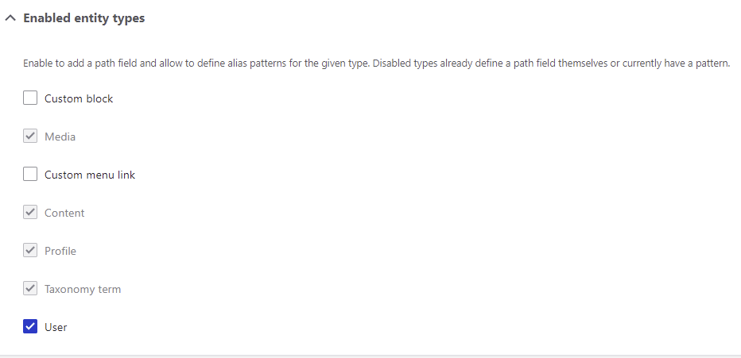
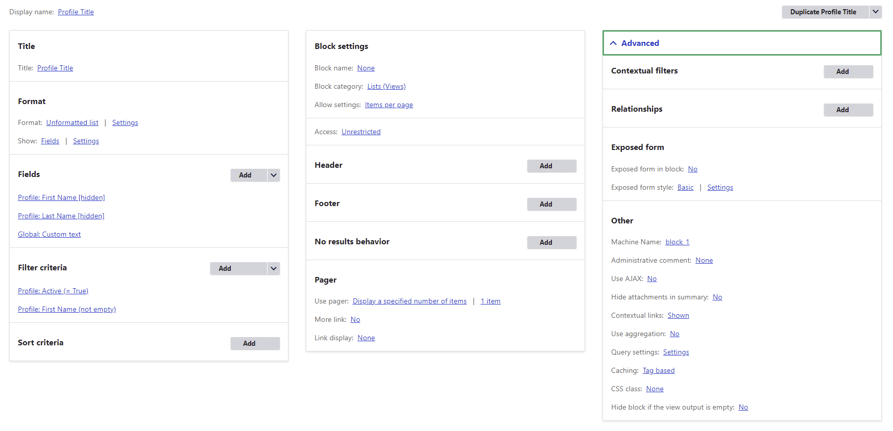

The profile module is a nice tool to have on a Drupal site if you're looking to create public-facing profiles about your users (e.g. staff). But it has a few weak spots including being unable to change the URL alias - it can only be /profile/id - or the page's title which shows up as [Profile Name] #[id], e.g. "Staff Profile #1". That's not very helpful. There are two places that the profile title needs to be overridden: what appears in the main body of the page and the title tag for the page which you'll see in your browser address bar. In my case I wanted to show the first name and last name instead, so I started by creating those fields on the profile as standard text fields.

With the fields in place, this post, and [accompanying GitHub code and configuration](https://github.com/ryan-l-robinson/Drupal-profile-title-override), is how I worked around those issues.

## The URL Alias

Like other nodes, the URL can be changed using [the pathauto module](https://drupal.org/project/pathauto) to generate based on a pattern. Note that this takes a change in the pathauto configuration, which might not be obvious if like me you did the initial round of pathauto configuration long before adding profiles.

Here's a screenshot of the settings page, which can be found at /admin/config/search/path/settings:



Once the ability to set paths for profiles is turned on, you can switch over to the Patterns tab and create the pattern. I made mine `/staff/[profile:field_first_name]-[profile:field_last_name]`.

## The Page Title

I fixed the page title displayed within the body with a view. I also altered the display of a profile to not show the default title and not show the first name and last name otherwise.

I won't break down every setting, but here's a screenshot of the view configuration:



You can also see this in configuration YML form in the GitHub project's /sync/config/views.view.profile.yml file. Once the view is ready, add the block to the correct place in your theme, and turn off the standard Page Title block for those pages (based on the URL).

## The Browser Title

The second one required a custom module, albeit a relatively simple one. This is the key part:

```php
/**
 * Implements hook_preprocess_html
 * 
 * Overrides the "Public Profile #[ID]" title with the first name and last name of the profiled staff member instead
 */
function profile_title_preprocess_html(&$variables) {
  if (stripos($variables['head_title']['title'],"Staff Profile") !== false) {
    //Get the ID from the original title to be replaced
    $profile_id = substr($variables['head_title']['title'],stripos($variables['head_title']['title'],"#") + 1);

    if (isset($profile_id)) {
      //Load the profile
      $profile = \Drupal::entityTypeManager()->getStorage('profile')->load($profile_id);

      if (isset($profile)) {
        $first_name = $profile->get('field_first_name')->getString();
        $last_name = $profile->get('field_last_name')->getString();

        if (isset($first_name) && isset($last_name)) {
          //Change the title to first name and last name
          $variables['head_title']['title'] = "$first_name $last_name";
        }
      }
    }
  }
}
```

Note: with PHP 8+ I used str_starts_with instead of stripos, but this works just as well for this purpose.

Along with overriding the title, it also provides a warning to users. Because it is relying on overriding only when the current title follows a certain pattern, it is a little bit fragile in that changing the display title of the profile will result in the code no longer being activated. It won't break the site or anything, but will return to showing the default unhelpful title.

Here's that code. It's fairly simple, firing on the hook for a profile edit form and then displaying a standard warning.

```php
/**
 * Implements hook_form_FORM_ID_alter
 * 
 * Adds a warning to the admin page for the profile, to advise against changing the title
 */
function profile_title_form_profile_type_edit_form_alter(&$form, \Drupal\Core\Form\FormStateInterface $form_state, $form_id) {
  $message = [
              '#type' => 'container',
              '#markup' => '<p>Warning: Do not change the display label of the staff public profile without altering the corresponding code in the custom module profile_title.</p>
              <p>Failing to do so will result in the title of the profile page reverting back to showing the generic profile name instead of the staff member name.</p>
              ',
            ];
  \Drupal::messenger()->addWarning($message);
}
```
