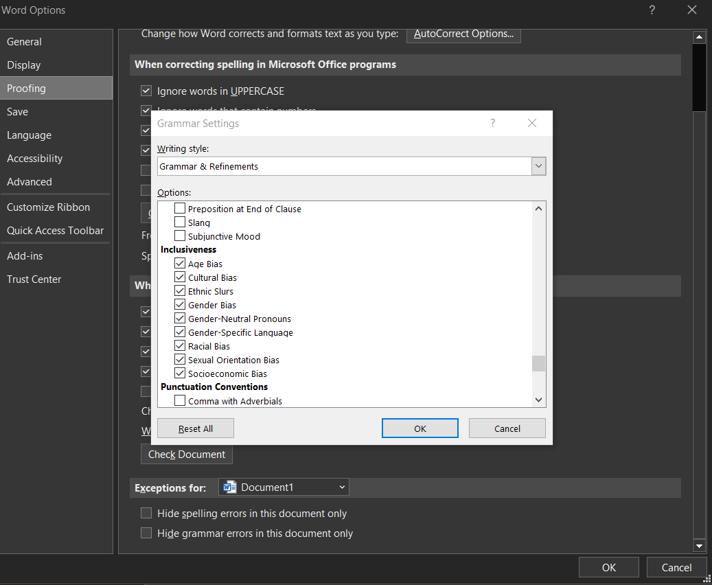

I recently learned that Word has a lot of options for what kinds of prompts the spelling and grammar check will give you. One category of these options is inclusivity, helping you write in a way that better includes everyone. Many of these also conveniently double as being more concise, e.g. "child" instead of "boy or girl" or "spouse" instead of "husband or wife."

To turn these on (using the latest Windows version of Word):

1. Click on "File" from the main menu
2. Click on "Options" at the bottom
3. Click on the "Proofing" tab
4. Under "When correcting spelling and grammar in Word," select the "Settings" button beside "Writing Style"
5. This will open a pane with a long list of options, including the inclusive writing tools. Check the box beside each option you want to turn on and apply your choices.

The option categories are:

1. Age bias
2. Cultural bias
3. Ethnic slurs
4. Gender bias
5. Gender-neutral pronouns
6. Gender-specific language
7. Racial bias
8. Sexual orientation bias
9. Socioeconomic bias

If you want to be more inclusive in your writing, this is a helpful tool to turn on and have in your toolbox.