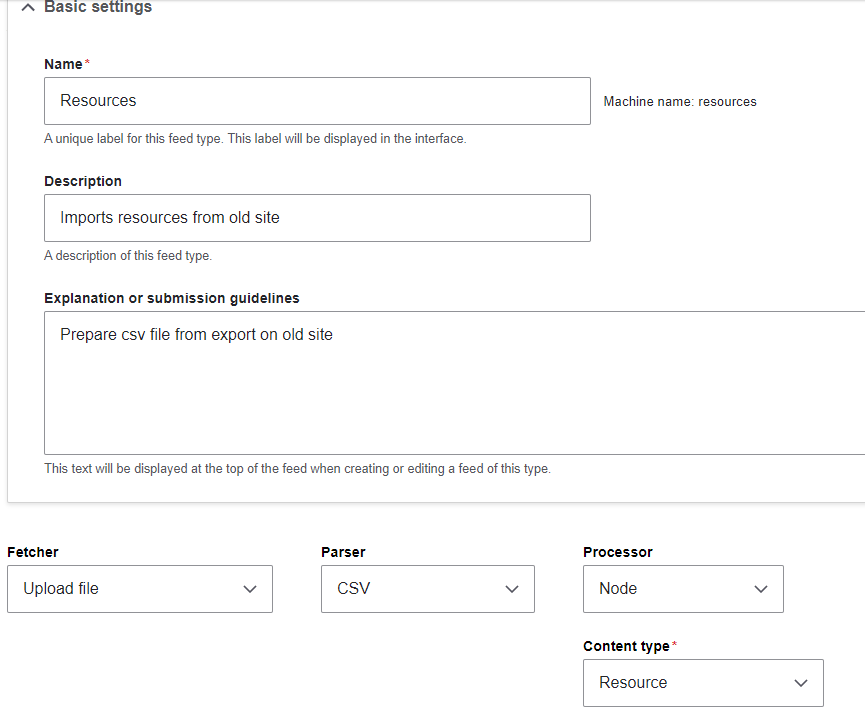
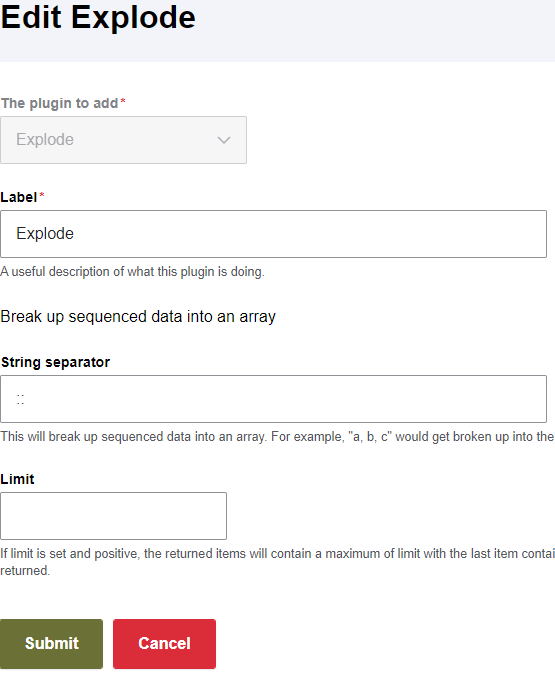

A few months ago I was part of migrating content from an old Drupal 7 website to a new Drupal 9 website. Much about the data structures were similar, but some components were not. The biggest one was a field on the old site using field collections while the new site needed the newer [paragraphs](https://www.drupal.org/project/paragraphs) module instead. Each field collection/paragraph contains two fields, one for a title and one for a longer description. That already gives us one complication in a migration strategy, because those (collection or paragraph) are separate entities which are linked to the main node, so it is a bit harder to create those and link them in one smooth import.

A second complication comes from it being possible to have multiple field collections on the old site and also multiple paragraphs on the new site, so we'll need to navigate collapsing multiple entities with two fields each alongside the related node into one export, then import that to again have multiple paragraphs with two fields each connected to the correct node.

This post may not be as precise as I'd usually like because it was a while ago and I can't easily recreate all of it, but hopefully it will be close enough that a Drupal admin would be able to fill in the gaps sufficiently.

## Drupal 7 Export

Step one is setting up the export from the old site. This relies on [the views_data_export module](https://www.drupal.org/project/views_data_export) to help generate a csv export. The view should be based on the main content type node that you'll be exporting.

I added a relationship between the node and the field collection.

I added each of the field collection's fields to the Fields of the view, to be included in the export. There were other fields to also consider in the export, as well as other options around formatting, but those are fairly standard views behaviour and not related to this problem, so I won't detail them.

The end result should be that you can get multiple rows for each node with field collection combination, e.g.:

```csv
Node Title,Field Collection Title,Field Collection Description
Node 1,Field 1,Description 1
Node 1,Field 2,Description 2
Node 2,Field 3,Description 3
```

## Data Cleanup in Excel

I now needed to collapse each node into one line. I did this somewhat manually in Excel, copying field data into each row but separated by double colons (::). You can choose any character separator as long as it won't occur naturally within the field, so you probably don't want as simple as a single : or ;. In my scenario we were dealing with about 1000 nodes, about 100 of which had multiple field collections from this field. If you have much more than that, you probably want to script something to combine the rows for you.

```csv
Node Title,Field Collection Title,Field Collection Description
Node 1,Field 1::Field 2,Description 1::Description 2
Node 2,Field 3,Description 3
```

Note: there may be other complications here like what text encoding to use, depending on the characters in your data. Similarly you may have to navigate whether each column should be separated by a comma (,) or something else. I won't get into that here.

## Drupal 9 Feeds Configuration

The data is now ready to get into the new site. This import will be handled by the [feeds](https://www.drupal.org/project/feeds) module, with help from [feeds_tamper](https://www.drupal.org/project/feeds_tamper).

I created a new feeds type from Structure -> Feed types -> Add feed type. Fill in the options. 

The most important is the second group, the basic options of how to grab the data and what to do with it:

- Fetcher: Upload file
- Parser: CSV
- Processor: Node
- Content type: [Your content type, in this case it was Resources]



On the mapping screen, I added a straightforward mapping between the Field Collection Title in your csv file and a temporary text column (allowing multiple values) created in your content type of the new site.

After this, the import will be able to bring in data and put it in new nodes of the content type, but the text in the temporary fields are still separated by the :: if there are multiple.

Now I went over to the Tamper tab and found the field you need to split up and added an "Explode" tamper plugin for that field, specifying the string separator and a label. I repeated this on each these temporary multiple fields.



This will now leave us with multiple entries in the temporary field directly on the node. We still need to turn those into paragraphs and associate those paragraphs with the node, which is where we run out of options within Feeds to handle it on its own.

## Custom Module

The final piece is to convert the temporary text fields into multiple associated paragraphs instead. This will be handled with a custom module. I've created [a generic demo of this available in my GitHub](https://github.com/ryan-l-robinson/Drupal-paragraph-split). This is the main PHP file.

```php
<?php

use Drupal\Core\Entity\EntityInterface;
use Drupal\paragraphs\Entity\Paragraph;
use Drupal\user\Entity\User;
use Drupal\node\Entity\Node;

/** 
 * Implements hook_ENTITY_TYPE_insert() for 'nodes'
 * When a node is created, with content in the temporary field, create the associated paragraph instead
 */
function paragraph_split_node_insert(EntityInterface $node) {
    //If node content type is node_type
    if ($node->getType() == 'node_type') {
        if (!$node->get('field_title')->isEmpty) {
            $new_paragraphs = array();

            $count = count($node->get('field_title'));
            for ($k = 0; $k < $count; $k++) {

                //This is needed to handle when there is a title without a matching description
                $desc = (empty($node->get('field_description')[$k])) ? '' : $node->get('field_description')[$k]->getString();

                //Create new paragraph entity
                $paragraph = Paragraph::create([
                    'type' => 'paragraph_type',
                    'field_title' => $node->get('field_title')[$k],
                    'field_description' => $desc,
                    'uid' => 1,
                ]);
                $paragraph->save();

                //Add the new paragraph to the array
                array_push($new_paragraphs,array(
                    'target_id' => $paragraph->id(),
                    'target_revision_id' => $paragraph->getRevisionId(),
                ));
            }

            //Overrides if there was already one in place, which there shouldn't be in this context of an import
            $node->field_paragraph_reference = $new_paragraphs;
        }

        $node->save();
    }
}
```

The module logic is relatively straightforward:

1. Hook is on the node being created but it will only continue on a specific node type. Everything else is irrelevant in this scenario.
2. If the temporary title field is provided, continue. Otherwise there's no extra handling needed. In this context there was never a description without a title, so this was safe. You may need more handling for those scenarios.
3. Loop on every match found, since there can be multiple in the temporary title field.
4. If there was a title but not a description - which did happen in our context, unlike the reverse - then the description, replace with a blank string.
5. Create a new paragraph entity and save it.
6. Create a new entry in the field of the node that links to the paragraph, with the paragraph's ID and revision ID.
7. Save the node when done.

Note: another approach here that would also involve custom module code would be to build this handling directly into the feeds import instead of hooking on the node being created. That's probably a bit more precise to run only in this one context. This hook on node insert does run more often, which is both less efficient and could be extra safety in case somebody accidentally put data in those temporary fields manually instead of creating the paragraphs. In any case, this was a quicker one for us to prepare, which was the priority with getting a one-time import done.

When the module is ready (including an info file), enable it and give it a test run.