Suppose you want to be able to specify a contact person for most nodes of content on a site, which will then show up in the sidebar with a label and some information about the contact person. Each node could have zero contacts, could have one contact, or could have several contacts.

I solved this using a combination of [the Paragraph module](https://www.drupal.org/project/paragraphs), [the Profile module](https://www.drupal.org/project/profile), content type fields, and views. A demo of this is available in [my GitHub](https://github.com/ryan-l-robinson/Drupal-paragraphs-sidebar) that you can load up using [GitPod](https://www.gitpod.io/).

## Create the paragraph and its fields

First, create the paragraph and its corresponding fields. In my case, I wanted two fields: a label that will be displayed, and a user reference to connect to a staff user account.

I created the paragraph type and called it “Contact.”

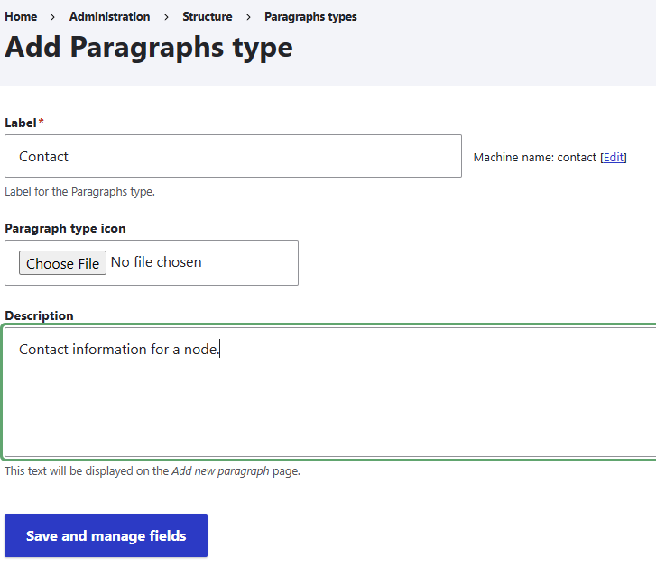

Next, add a field for the label, as a text select to choose from a few pre-defined options including "Primary Contact," "Secondary Contact," etc. Only allow one label per paragraph, which is different from where we'll later allow multiple paragraphs per node.

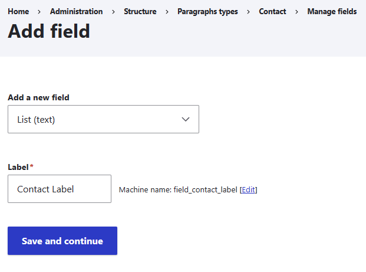

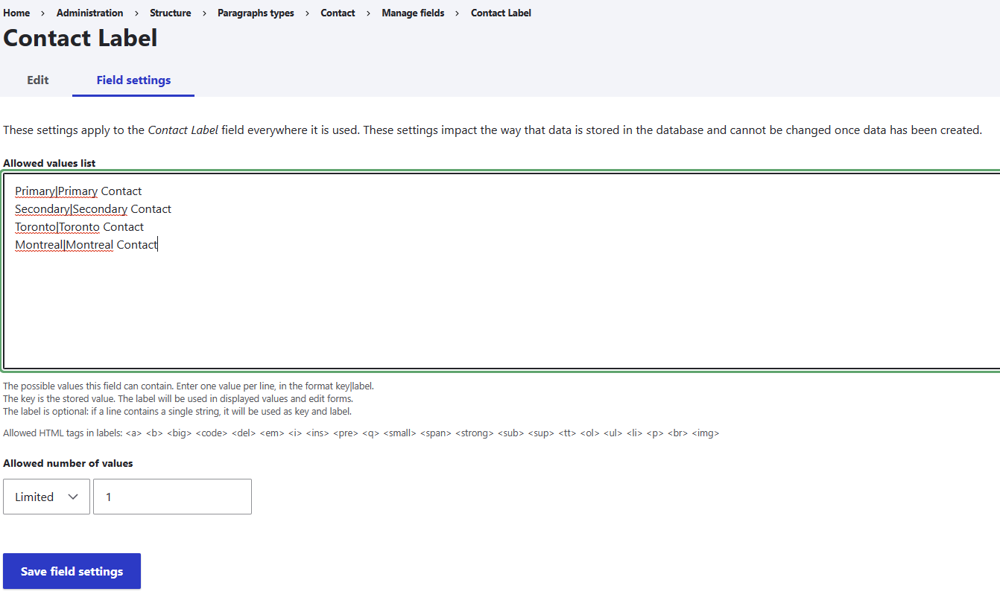

Finally, add a field for the user reference. Set this up to show up as an autocomplete, filtering to only show those who are of the Staff role.

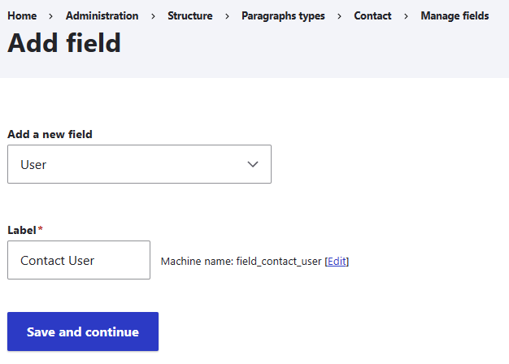

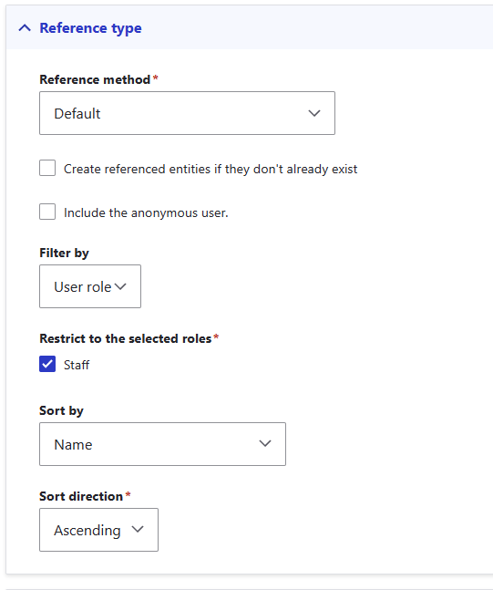

## Assign to a content type

Add a field on the content type that references this paragraph. The field type is going to be an entity reference revision.

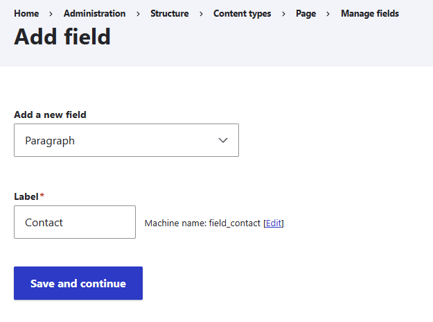

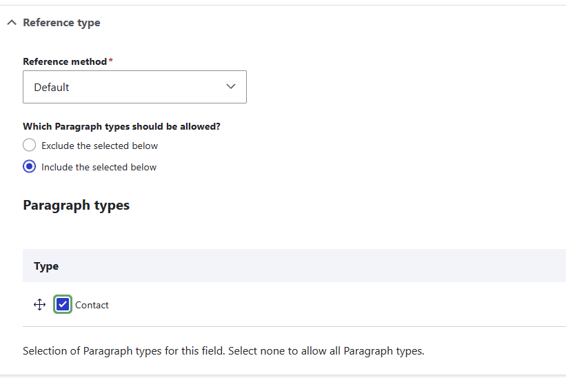

In this case, since it's going to display it in the sidebar using a view, also remove it from the display for the content type. I won't get into details of designing the page on this post.

This step can be repeated to add the field to multiple content types, so that you can have the consistent design on all of them.

## Create the profile

For the sake of this demo, I'll only add a couple of fields to the profile - a name, a phone number, and an email - and I won't do any of the design of the profile page, just creating the fields for the purpose of showing it in the sidebar of the content.

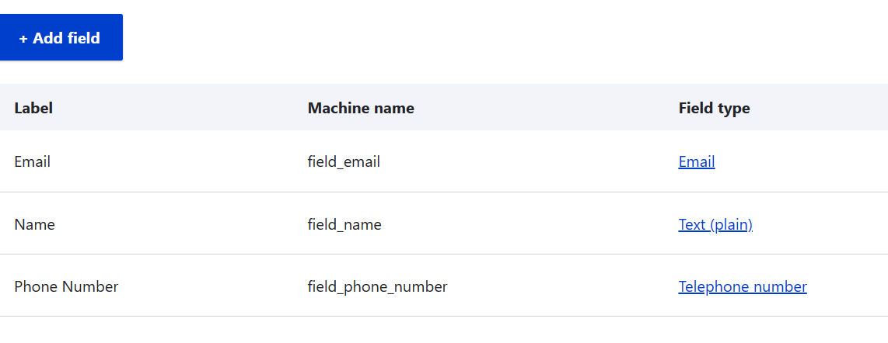

## Create sidebar view

That's all the underlying structure. We can now proceed to creating the view itself. This will be a view of content, because while it will be showing paragraphs, it will be showing those paragraphs based on the content being viewed. It will be a block, since we're going to want blocks that can be placed in theme block regions.

Next, make a contextual filter so it will only show content related to the current content on display. This will be on the node ID of the page being viewed, so that only paragraphs related to the current node will come up as results. Create a filter for content ID and set the default to be "Content ID from URL."

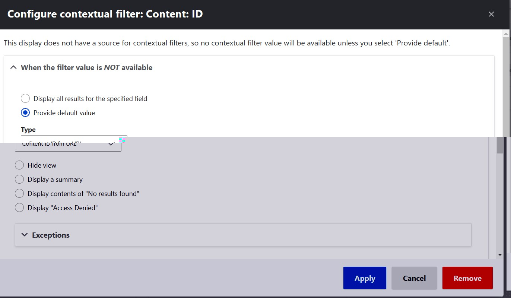

Now we need to create the link between the page being viewed and its contact paragraphs. This can be done with the relationships functionality of views. Under Relationships, click on Add, then select "Paragraph referenced from field_contact."

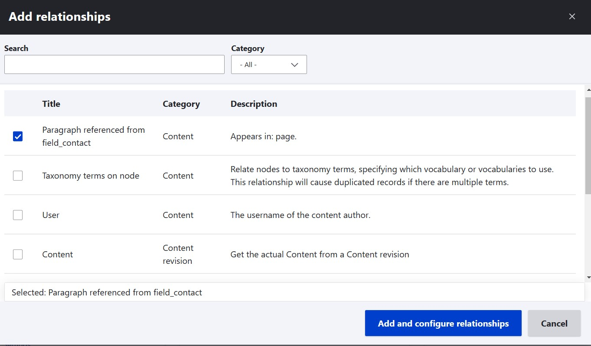

We then need two more relationships:

1. From the contact field of the paragraph back to the user: "User referenced from field_contact_user."
2. From the user to the profile, which will have the majority of the fields we want to display: "Profile."

The last setting we'll change in the Advanced section is near the bottom: set "Hide block if the view output is empty" to Yes. We don't want it to show up at all if there isn't a contact for the current content.

Now that we've built the complexities of the query, we can return to the more common configuration in the left pane to determine what is shown. I set:

- Display for the view to an unformatted list of fields.
- The fields are the contact name, the contact label, the phone number, and the email address, all from the associated profile. Each field is set to be hidden if there is no result, in case a profile is created with some information but not others, e.g. somebody offers their email but doesn't want to share their phone. You can also add more styling around how these get displayed (labels, links, etc).
- Filter on the paragraph type to be "Contact," on the paragraph to be published, and for the user to be active. This helps avoid unexpected results when a user is later blocked, or somehow another paragraph type is associated to the content.
- Sort by the contact label and then by contact name, which will be more intuitive to users than sorting on something else like authored date.

We can go back to the settings on the Unformmated list to group results by the label, so that the label will show up as a header. If you want more precise control over what HTML tags are used for which elements, [semantic views](https://www.drupal.org/project/semanticviews) is another great module.

## Place block view in sidebar

Finally, add the block to show in that sidebar for all relevant content types. Of course this will depend on your theme having a sidebar region, but most have at least one.

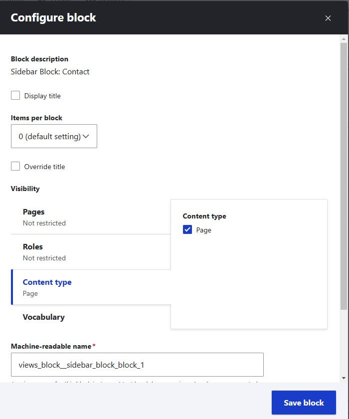

## Final result

Here's an example of what all of this looks like, at its most basic level without any extra CSS styles added:

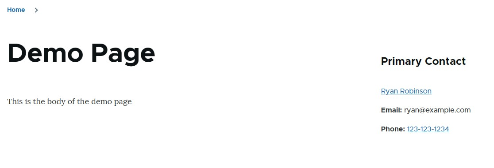
