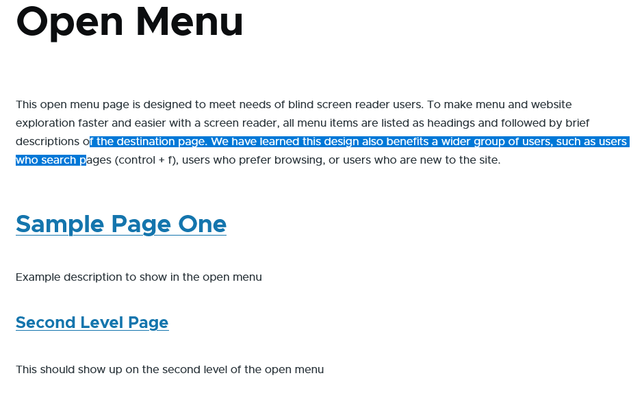
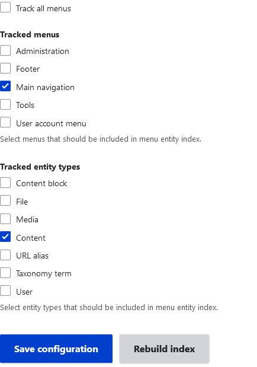

[In a previous related post, I wrote about some lessons in a co-design project of an open menu, with a video where we presented about it to the IDRC](/posts/2024/idrc-presentation/). That was mostly about the process and this is about the result: a header navigation page on a Drupal 9 site. The goal was to provide an overview of the same information that’s in the main navigation, but in a more accessible way for screen readers and with descriptions that provide more information about the page without having to load the page. It was not a complete index of every page on the site; it was only an alternate format for the menu.

As mentioned in that previous post, an important requirement is that it must update programmatically; we cannot leave it as a separate manually-updated page, because realistically it would only be a matter of time before somebody updated the menu but not the header navigation page.

There's [a GitPod demo version of my solution on my GitHub](https://github.com/ryan-l-robinson/Drupal-open-menu). That’s only the relevant customizations, not a full functioning site, and you'd need to add a couple of menu items to really see it in action.

Here's an example screenshot of the open menu structure:

## Menu Entity Index

If you’re familiar with Drupal, you likely read the introduction and immediately thought of views. Views are the perfect solution whenever you are looking at a scenario involving one data source displayed in multiple ways. Drupal 9 does not expose everything I needed to views on its own, but there is a module that fills in the gap: [Menu Entity Index](https://www.drupal.org/project/menu_entity_index).

Once that is installed, you’ll need to configure it. I did not find the settings page intuitive at all, but the first block of settings is which menus need to be indexed and the second block is which types of target to index. In my case, I only want to index content in the main navigation.

Notably, it cannot index views pages, so for this scheme to work, you can’t use views pages in the menu. Fortunately you can still make a views block, put that on a page, and put that page in the menu.

## Configure the View

The configuration for the view itself won't be too much of a surprise for anybody who has configured views before. It has a grouped block for each second-level menu, where the header had a programmatically-set ID so that they can be used for links (both from that top block and from the top level of the main menu itself). There's a lot of mundane configuration here so I won't break it all down, but [here's the configuration file](https://github.com/ryan-l-robinson/Drupal-open-menu/blob/main/sync/config/views.view.open_menu.yml) if you want to import to your site, or you can check it out using the GitPod demo and going to Structure -> Views -> Open Menu.

## Overriding the View Template

I still had one more problem. The view involved used the grouping function to bunch together the results. I wanted the group label to be an h2 and have an id on it, so I did that using the rewrite the results functions. That worked with no issues.

But I noticed it was also supplying an empty h3 immediately before my h2. That doesn’t hurt sighted users, but it does complicate the experience for screen reader users. It took some time to realize the h3 was coming from a template file in the views core module: views-view-unformatted.

Once I knew the source of the original file, I could edit it directly, but that would be lost as soon as there was an update to the theme. The more permanent answer is a subtheme with an override of that file. That seems a little excessive in the case of this demo, but in a real site you'll probably want a custom subtheme for all your CSS and templates anyway.

[That file is also in the GitHub](https://github.com/ryan-l-robinson/Drupal-open-menu/blob/main/web/themes/custom/demo/templates/views/views-view-unformatted.html.twig), but it was a pretty tiny change removing the h3 wrapper from the grouping.

## Caveats

There are a few caveats to this system:

- There's no handling for menu items more than 2 levels deep. That may well be possible, but we didn't need it, so I haven't included it in this demo.
- No views pages in the menu will show up in the open menu. But view blocks inserted into a page, where the page is in the menu, will show up.
- Be very careful changing the module settings. Perhaps this is fixed two years later, but at the time, attempting to index certain entity types would result in a white screen of death on the next cron run. We've never had problems with indexing content.

You could add some built-in warnings to the admin interface, or even override admin forms, to try to suppress the possibility of those caveats causing a problem, but this blog post was long enough so I'll leave it here.
