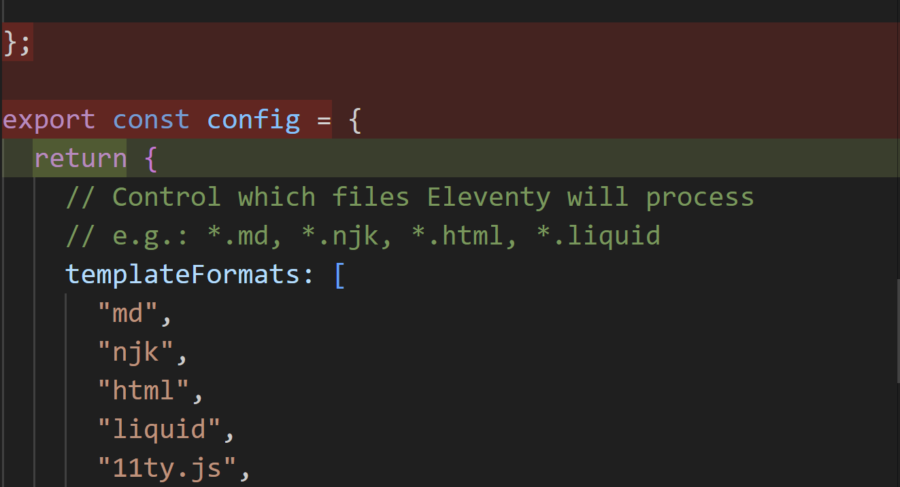
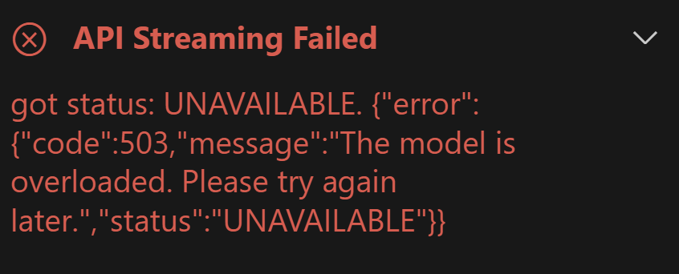
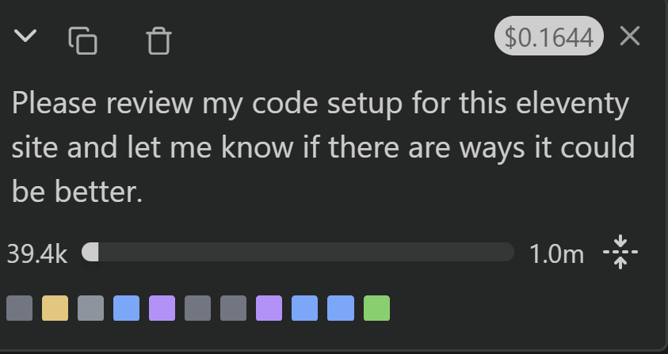

I have little interest in using Large Language Models for much other than coding, and that only [as long as you are still validating that the result is correct and learning from it](/posts/2025/principles-ai/), not using it to offload all your cognitive processing, but I did decide it was time to give that specific situation a more serious try.

I work mostly within [VS Code](/tags/visual-studio-code/), so whatever I'm going to use I want to be fully integrated to that. This does get complicated, because there are a few overlapping factors:

- Which underlying model is best for which kinds of problem?
- What does each model cost, and does it make more sense to pay per-token or monthly?
- What VS Code extensions combined with what models provide what kind of integration with VS Code? Can it read multiple files to keep in context, offer suggestions within files, run scripts, etc.? How user-friendly are all those things? How secure are those things?

Because there are too many overlapping variables, I'm not really going to try to give definitive answers to those. I'm only going to provide some notes on what I have tried and what I thought about it.

## Copilot

Copilot was the first of these coding assistants, before anybody was even calling these kinds of tool "AI", and at least in theory is the most deeply integrated to VS Code.

In terms of modes, it offers a chat mode, an edit mode, and an agent mode. Chat is fairly self-explanatory and if you've used an LLM elsewhere, that's what it is: no touching the files, just a simulated conversation. I assumed edit mode meant that it would suggest edits to my files. The description of that mode sounded that it would. Maybe the task I gave it - writing unit tests for a custom Drupal entity - was deemed too complicated to be allowed to run in that mode, but it didn't make it clear; it just gave me a response in chat. So I switched to agent mode for the rest of the testing and that's where the real power seems to come in, able to suggest changes to files and suggest non-destructive terminal commands.

It was not very friendly in switching from Chat to Agent. If you start out thinking you just need a chat, then realize it would actually help to see the suggestion being applied to the code, you can't do that without starting the conversation again.

Copilot also can suggest code as an autocomplete function right within your main code editor as you work. I can see why some people like that better. It is maybe faster once you get used to it. I tend to feel like it's in my way, breaking my own concentration too much, and I'd rather restrict it to acting when I tell it to.

It does require logging in with a GitHub account, even for free usage, which might be a nuisance if you don't want to have a GitHub account, but realistically a large portion of the kinds of developers who would use it have a GitHub account anyway.

I could not figure out adding context files to my chats. When I clicked on the button to add context, it gave me a file browser, but if I tried to browse down to the file I wanted, it just made the whole folder the context instead. I did not know how to browse down to more specific context.

It does seem to read the entire codebase without the human user specifying what to read or asking for permissions, which means it would be using up more tokens but if you're paying monthly it doesn't matter as much. More significantly, you better make sure there's nothing sensitive in that codebase that it could be reading and feeding back into a free model.

It gives access to a few models even in the free tier, including Gemini Flash 2.5, Claude Sonnet 3.5, and GPT 4o, which are the three that I tried to get to write unit tests for a custom entity in a Drupal 10 module. Perhaps this is the best thing to say about Copilot, in that it allows trying all the models without setting up accounts and API keys for all of them, especially since most of them do not have a certain amount available for free. All of those tests would have cost me (a little) money and the hassle of creating accounts otherwise.

With those general notes out of the way, how did the different free models do at a task writing Drupal unit tests?

### With Gemini Flash

I first tried to solve the problem with Gemini Flash 2.5 as the model. It did not do well.

It made a couple truly nonsensical mistakes, like removing the php declaration at the start of the file or sticking a newline character in the middle of a use statement, both of which obviously become a fatal error right away. These are the kinds of mistake that a basic linter would detect, so it was very strange to see them made here.

A couple of times it said it made a change in the file, but didn't actually do it. That was also confusing.

Ultimately, it got stuck pretty quickly, not able to figure out what else to do and not having made any significant progress on the problem.

Maybe there was something about my use case where I missed an important step, but based on those tests, it definitely was not helpful.

### With Claude Sonnet 3.5

I then tried Claude Sonnet 3.5, still in Copilot. That seemed promising at first: fixing issues and applying style standards that I did not even explicitly ask it to do.

It then asked for terminal permission to run the tests, then kept improving on its own based on the errors it read from the test output. That was nice, not needing to run the test command myself every time but still confirming permission so I could stop it if it tried to do anything dangerous.

It then got stuck, though not nearly as fast as the Gemini model did. It was actually changing things reliably, and the errors were different (whether that was better or worse different I can't say). But it did eventually also give up, aware that it wasn't working but having tried everything it could "think" of and stuck in a loop of the same few ideas repeatedly.

### With GPT 4o

With GPT 4o and Copilot the results were similar to Claude Sonnet.

One minor difference was that it asked in the chat first if it could run the tests, and I had to type yes, then it gave the prompt asking to run the command line Claude had done and I clicked approve on that. So it made running the tests each time slightly easier than Gemini but less easy than Claude on that point. Then it did read the results and kept iterating from there.

It eventually stopped, thinking it got it working, and I ran the tests again myself. It had a couple fatal errors, so I fed those back into Copilot and it ran again for a while. Then it got stuck in a loop, much like Claude's loop except that it declared itself done without even running the tests and I had to run them myself.

## Gemini Code Assist

I briefly tried [the official Gemini Code Assist extension from Google](https://marketplace.visualstudio.com/items?itemName=Google.geminicodeassist). It's a very friendly and straightforward interface. It says it has an Agent mode in preview. I tried in once and it couldn't even find the file that I was asking it to review.

I also noticed immediately it did not have a couple of nice features which I had already learned that the extension I'll get into next offers. It's just a user-friendly chat integration that's easy to use if you already have a Google account as most people do and not much more than that.

Later update (December 12, 2025): mainly because cline has been somewhat unreliable, I've tried Gemini Code Assist again. It has improved a little, but is also still frequently buggy, failing to connect to the model occasionally with no helpful error. The even bigger discovery, though, is that unlike the others, if you use this with a Google account that has a Google AI Pro subscription (including the free trial I got with my Pixel 10 Pro), you get much higher usage limits. I'm not going to use it nearly enough to justify paying $270 CAD/year to keep it after my free trial, but it is definitely worth trying to make full use of it in the few months I have left.

## Cline

That gets me to the extension that I have now tried out the most and like the most so far: [Cline](https://marketplace.visualstudio.com/items?itemName=saoudrizwan.claude-dev).

Cline allows connecting to a wide variety of models, using your own API keys. Unlike Copilot, there's no middle man where you could instead pay them and get a lot more access to a bunch of models. I grabbed an API key for Gemini and put it in. I had hoped that I had unlimited use of it for a year, because with my new Pixel 10 Pro I have Gemini Pro for a year, but that free trial does not include API access for coding, which is really the only thing that I wanted it for. Anyway, the extension makes it as easy as possible to add an API key for the model of your choice.

It offers two modes: Plan and Act. Plan won't write any code for you, just be a chat agent similar to having a chat in the browser, except that it can work with more valuable context of whatever in your codebase you decide to provide as context.

Act is the Agent mode, which like Copilot is where it gets really interesting. It will tell you what it is going to do in response to your request, then it will propose the changes. Those proposed changes will show up in the main code window like any other diff viewer that you are probably used to in Code. This gives you an easy way to track exactly what it is changing, one file at a time.

There is an option to auto-approve whatever it wants to change, but to me, that violates the rule that I only want to learn from this, not offload my thinking onto it. I want to make sure I am going slow enough to understand exactly what it is doing and why, so I am not going to auto-approve.

There are a couple other features of Cline that I really like:

1. You can define a rules file which gives it extra standard instructions. These can be set up per project, but then the front matter in each rule can differentiate even more by file type. For example, I can tell it to always use Drupal style and best practice if I'm editing a PHP file within a Drupal project, and that rules file can be committed as part of the project so everybody working on the project gets the same guiding rules.
2. It shows you the amount of tokens and the cost so far of this query, which is a great way to keep track of how much this is costing you and encourages you to not use it any more than you really need to.

Like Copilot, it can also run script commands, like clearing caches or executing the phpunit tests it tried to write. It was a more clear interface about those terminal suggestions, prompting you first to save the changes and then to run the test instead of showing you both buttons at once.

It was a really positive experience at first, better in every way than Copilot, other than Copilot giving access to a couple more models for free.

Then Cline started failing on me, frequently saying that "the model is overloaded" even though when I tried the same model from the other extensions they were fine. Because I had to keep querying repeatedly when it failed, it used up my daily free quota on Gemini Pro a lot faster. I hope this is a temporary short-term bug, because it wasn't a problem at first.

## A Note on Pricing

Thanks to the Cline details on what the price would be if I was past the quota for free usage has given me some rough estimates of costs when paying by token or by subscription. Here's basically what I found, using Gemini Pro as the model.

Just loading in the context of all of a moderately-complicated Drupal module cost me about $0.09. As I worked through a moderately-complicated problem that needed a few tweaks, I got up to a total of about $0.40. I gave it a few more problems of similar size that ended up with similar price. I assume that's USD, but maybe one minor complaint about Cline is that it does not specify that at all; maybe it is CAD knowing it is tied to my Canadian Google account. That's for it reading my code context, making code changes, then tweaking a little more as I followed up with a few pieces that weren't quite ideal yet.

By comparison, it's $19 USD a month for the Copilot Business subscription. So assuming about 22 work days in a full month (no vacations or anything), that's roughly equivalent to 2 of those kinds of problems per day before the subscription starts being cheaper than by token. If you're handing off all your work to it, a subscription would pay off, but as I already said, I do not recommend that approach. If you're more like what I am somewhat interested in, using it only occasionally when you're stuck - the way I also use search engines - and maybe some general code review, then the per-token price is likely to be a better deal.

Of course, that's just using Gemini Pro's pricing, and with a small sample size of the problems. Other models would be different. How much contextual code you provide might change it dramatically. How big of the problem it is solving would certainly change it dramatically. I offer this only as a rough estimate to give a sense, but I think the general conclusion is likely true: per-token makes sense as long as you're using it to help you do work, not to do your work for you.

## Conclusions?

As I said in the introduction, I don't have a lot of strong conclusions to make because there are too many interconnected variables and these tools are all evolving fast enough that any conclusions may be not be valid for that long anyway. What I can say at this point:

- Google Gemini Code Assist is bad and I see no good reason to use it unless you have a Google AI Pro membership anyway, in which case the worse experience might be an acceptable cost for saving money.
- Copilot is great for experimenting with models, and might also be a better choice if you are going to use it enough as to justify the monthly subscription.
- Cline is my favourite to interact with, but those "overloaded models" disconnections got pretty frustrating pretty fast.
