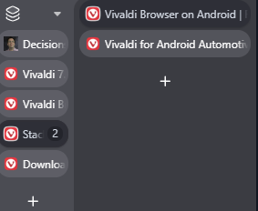
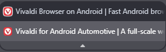
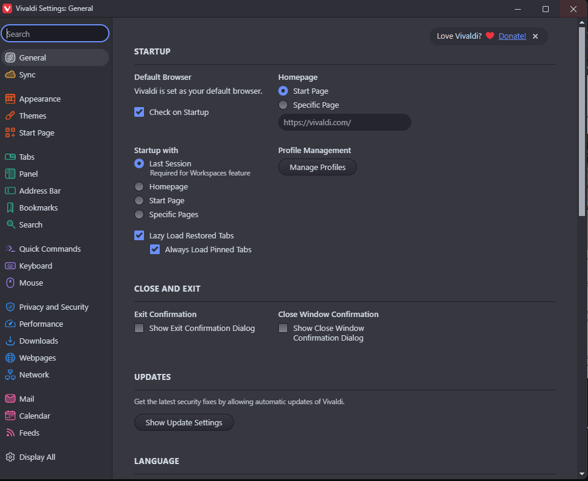

As I noted briefly in [a previous post](/2026/big-tech-decisions/), I was not feeling any particular need to switch my personal browser from Firefox to anything else, or my work browser from Edge to anything else. Then I saw a reference from [Vivaldi](https://vivaldi.com) on Mastodon to a really interesting new feature that to my knowledge no other browser has. I will get into that feature a bit more below, but that feature - and the coincidental timing of when I am already reevaluating a lot of my tech choices - gave me enough of a prompt to give it a try.

After one workday of trying to use it and some experiments with it at home, here are my thoughts so far.

## Getting Started

The first natural thing to do is try to import all your settings from a previous browser, to avoid having to repeat setting things up. There are options in Vivaldi to do that from Edge and from Chrome. Oddly, there's no way to import my data from Firefox, which is what had been my primary personal browser previously, so I'm out of luck there entirely.

Importing from Edge, which I tried on my work computer, is possible but with a bit of pain. It requires that Edge be closed. On Windows 11, Edge is never closed; it's always running in the background. To be able to import from it into Vivaldi, I needed to open Task Manager and end the task. There was no prompt to help you do this. I suppose the kind of people who are going to try Vivaldi are mostly the kind of people like me who would know how to do this, but it was a little strange.

## Tab Management

Here's the feature that prompted me to try it: [tab tiling](https://vivaldi.com/blog/vivaldi-on-desktop-7-8/). At least in theory, this is an extremely useful and convenient way to view two pages at once. This was something I saw and immediately imagined I would use a lot, like having one page of the site I'm testing and the issue summary side by side. In my few attempts at using it, it works as advertised. It's easy to use. It's easy to discover by accident (even if you try to drag a tab out to make a new window, you might notice the indicators that you could drop it into this same window). I have no notes for improvement on that.

It does some other interesting things with tab management as well, though.

It does have vertical tabs but it doesn't conveniently expand and collapse, aka auto hide, like it does on Edge or Firefox. Instead, it is one adjustable size at all times. I really like how Edge and Firefox keep the tabs out of the way when I don't need them, but then expands to be able to view them when I do scroll my mouse over there. This isn't a big deal on a wide enough monitor to still see all of the site anyway, but it just feels like another in my sentiment so far that Vivaldi has great ideas but is a little rough in implementation. Then came some good news: after I found a forum discussion requesting this feature, somebody replied saying that it "will probably come to 7.9 Final in a few months, but the feature needs some more polishing before it is ready." I'm hoping this is the case, and with a bit more patience I will have what is currently my largest lost functionality.

It also offers tab stacking, roughly equivalent to what at least Edge calls grouping. It's a way to minimize the space required for tabs, and making it more obvious which tabs go together, while still keeping them somewhat accessible. It has three options for how those stacks appear:

This is the Compact view:

As the name suggests, this minimizes the space required. It is also the least obvious at a glance that there even are other tabs there. If you scroll over the little line above the stack name, you do get a preview of that tab to remind you what it is before clicking on it, which is a necessity.

This is the two-level view:

This is other extreme, with needing a lot of space but making it really easy to tell which tabs are within the stack. Maybe if I had an ultrawide monitor I would like this more, but as is, it makes my challenges with the vertical tabs not auto-hiding even more of a challenge.

Finally, this is the accordion view:

This is in the middle in terms of space consumed, and is overall my favourite. When collapsed, it takes up about the same amount of space as two tabs, but it is also much more obvious that it is a stack and what you need to do to look within it compared to the compact view, and doesn't require an extra column of space like the two-level view. It isn't as clean of a look as how Edge handles tab groups, but it's the same idea. I'll leave it on that setting.

The Workspaces concept takes the grouping of tabs idea to another level. This is a toggle at the top of the tab bar. You can create a new workspace with a completely different set of tabs. They stay saved and accessible, even when closing Vivaldi in between, just tucked away behind that toggle not taking up space and confusing you on which tabs are related to what you're doing right now. I'm not sure how much I'll really use this. In my previous job doing client based work, when I sometimes had to do a lot of flipping between multiple clients, getting sidelined from one to address something more urgent for another, this might have helped more to keep each project straight. I could have had one workspace for each client, only closing each bundle of tabs when I finished that client's task. There is some degree that it is still true now that I can be juggling multiple distinct tasks, but mostly I think those rise to the level of groups/stacks, not workspaces. It's a good idea, just maybe not for me.

## Security and Privacy

In addition to tab management, security and privacy is the area that Vivaldi is most known for.

It's built on Chromium, but the fact that Chromium can no longer install full power ad blockers doesn't matter because Vivaldi has its own ad blocking built in. I did find at least one site where Vivaldi mobile failed to block the ads and it was jarring how terrible of an experience that is when you're used to not seeing them. That same site did block successfully on desktop. Maybe it isn't perfect, but it is probably at least pretty close, and I appreciate that it is there by default.

Proton VPN is built-in as well. You're only a click away from one of the best VPN solutions, even if you don't have a paid Proton account. Considering I also just signed up for a Proton account as a part of my attempts to limit my US Big Tech, I went ahead and signed in, but until I start paying for Proton there probably isn't any advantage to that. For free, it will automatically connect you to the fastest available server, and of the 10 countries available in the free level, Canada is one of them. As long as I just want security and not to choose where specifically to spoof that I am accessing from, the free version is fine.

## Other UI

Vivaldi is loaded with customization options, not just the ones about tab management and security I already covered. This is the power user browser. I'm not sure any of these are truly revolutionary, but it is still nice to see so much freedom to make it your own.

There were a few defaults I did not like but I did find settings to change them which I haven't already mentioned:

One was the progress bar on the tab when refreshing or loading a new page. When on that tab, I couldn't see the progress bar at all, so I couldn't tell that it was still trying to refresh. That means when I was debugging an error, I couldn't tell if the error was still there or if the page just hadn't refreshed yet. Sometimes when working with locally-hosted Docker container sites, it isn't obvious if it is just being slow or not. I found a setting that shows a circular indicator in place of the favicon in the tabs bar and like that better. This one I kind of think is a weird choice for the default.

Another default I didn't like was hiding the parameters in the URL of the address bar. This made it more annoying to debug something that involved the parameters. I found a setting to change that as well. I get why most people doing most casual browsing don't need to see those parameters and this is an entirely reasonable default, but when I'm developing, I do sometimes need them.

Speaking of developing, the Inspect Element is hidden under an extra layer of menu labelled "Developer Tools." That's obvious enough, but it means every time I want to inspect an element, I have that extra layer to navigate, and I inspect element a lot in my work. That doesn't have a clear setting for it, but buried under Appearance are options to customize what appears in what menu. I was able from there to move the developer tools up a level. It's a little clunky, but again this does make sense as a default: the people that don't want developer tools want them somewhat hidden under an extra layer, and the people that do will figure out how to change the setting even if it isn't that obvious.

## Bookmarks

Bookmarks are giving me the most trouble so far. Since there is no tool to import everything from Firefox, I tried to import at least my bookmarks. I went to Firefox and exported as HTML. Then I went back to Vivaldi, found an Import tool which allowed from HTML, and used that. The Vivaldi interface says it imported, but no bookmarks showed up. Then I gave up and tried to add a bookmark manually, and that didn't work either. I click on the button to add bookmark from the address bar and it doesn't do anything. I click on the + button within the bookmarks window and it doesn't do anything. Then it got even stranger: I checked it on mobile, after trying on desktop multiple times, and saw multiple copies of imported bookmarks. They somehow got imported and synced, but they don't even show up on the device that I imported them on.

Update: I tried importing again a few days later. It worked instantly this time. Maybe I got a bug fix update, or maybe something else weird was going on that I can't explain.

Another minor bookmarks nuisance is that it is tied to the right sidebar. I don't really want anything else from the right sidebar. Nicely, I could move the button to open bookmarks into other toolbars - that's great. When I click on it, it opens the bookmarks, as well as the rest of the right sidebar. Then when I close the bookmarks, it doesn't close the sidebar again. It's a minor nuisance, and I don't rely on bookmarks so much that it will really add up, but it's another in the "rough around the edges" category.

## Email, Calendar, and Feeds

I have to note that it also includes an email client. This is IMAP only, so if like me you are currently using an Outlook.com account, or considering moving to a Proton account, that is a step down compared to ActiveSync in desktop Outlook and the Proton app functionality respectively. It also includes a calendar app. Because these are only IMAP, I did not bother trying it. I don't think there's any real scenario that I will use it.

Vivaldi also includes feeds. Sort of. As far as I can find, there is no view to go to that shows all my feeds in one place. There is a button for "Feeds" in the Toolbar Editor but it refuses to add it to any of the toolbar areas, so I have no idea what that is supposed to go to. What did clearly work was a notification when there is a new post on a feed. That's maybe sometimes useful for certain feeds that I really need to know about right away, but for the most part not what I'm looking for. I hope it has a desktop equivalent to what I do with Start Launcher on Android, having my own customized news page that I can browse, and I just can't figure out how to open it.

## Mobile

Vivaldi also has a mobile app with sync between installations if you login. For the most part, I've had no rough edges yet except for one:

There's some weird duplication. When clicking on the button in the bottom left, I see Bookmarks, History, Notes, Downloads, and Translate. There is another longer menu that opens from the button on the bottom right. Among other things, that includes... Bookmarks, History, Notes, Downloads, Translate. I'd be happy to get rid of the one in the bottom left, because I really do not know what it is solving that isn't already solved by the full menu, but I did not find a way to do that.

## Conclusion

For now, I think my plan is to continue trying it out more for personal use on desktop and mobile, but not change from Edge at work yet. That largely comes down to what I've said throughout this post: there are a lot of good ideas, some of which I would probably benefit from, but there are a lot of rough edges, too. Personal use can afford to be a bit more experimental and put up with those rough edges than work use can.

### Personal Use: vs Firefox

Compared to Firefox for personal use, there are some advantages and some disadvantages. Firefox has worse tab management overall, but wins on that one simple factor that is always noticeable, the vertical tabs hiding out of the way. That problem might go away with the next Vivaldi release. A lot of the other tab management feature advantages for Vivaldi are mostly theoretical for me at this point, with maybe the occasional use for tab tiling.

Firefox has (a little) worse security built in, with no default VPN and needing another extension for ad blocking, but it's not hard to install Proton VPN on the computer separately or to install an ad blocker to Firefox separately so in practice it's not a major difference.

The argument might really just be over which company's mission and structure I like better. Firefox has been around longer, and it's important that they offer the rare non-Chromium browser option. They're based in the US. The Mozilla corporation describes itself as:

> a non-profit organization that promotes openness, innovation and participation on the Internet

Vivaldi is Norwegian, smaller and with less of a history. They describe their two ground rules for the browser as:

> privacy is a default, and everything's an option

They are both good missions. Vivaldi's is a little more precise in its guiding principles but which of those approaches is better is debatable. Firefox maybe gets a bit of an edge for not being Chromium and for a longer track record as being the most viable not Big Tech alternative. Vivaldi gets a bit of an edge for really pushing the limits on innovation and privacy, as well as being EU based instead of US based.

### Work Use: vs Edge

At work has different calculus. It's true that's where the tab tiling and other management tools would be more useful, since that is generally when I am juggling a lot of tabs.

But I also have a work Microsoft 365 account, on a managed Windows Enterprise device. There are some advantages in ease of use to tie everything to that one managed account.

A lot of those little rough edges I've named would also matter more in a work context doing something repeatedly and often in a hurry. Those might add up to more lost time than is saved by the tab tiling.

I'm always going to be a bit more conservative about changes I make at work, where the impacts are higher, so I think I'll stick with Edge there for now. But if I am trying Vivaldi more at home, then I will be more aware of those couple rough edges do get smoothed out in such a way that using it at work would make more sense. That leaves the door open that it could also become my work browser, just not yet.
