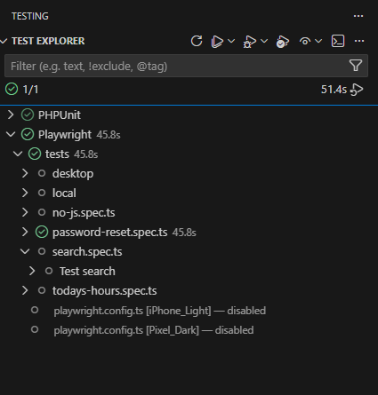

This series has now covered all the core functionality of having a local development environment and deploying updates. The majority of what's left has to do with automated testing, including this one using Playwright.

[Playwright](https://playwright.dev/) is a tool that can simulate browser activity and then assert that things are how you think they should be. That includes interactions, like expanding a menu or clicking on a button. It also includes the ability to emulate multiple browsers and operating systems and screen sizes and dark or light mode.

## Testing in GitLab CI/CD

### Testing Image

I have [a project in my GitLab](https://gitlab.com/ryan-l-robinson/playwright-axe-Docker-GitLab) that creates a Dockerfile which can be used to run tests, storing that container in the GitLab container registry where other projects can use it to run tests.

The Dockerfile is straightforward, using a general image from Microsoft and making a few small tweaks from there to be able to run my specific tests:

```Dockerfile
# Get the latest version of Playwright
FROM mcr.microsoft.com/playwright:v1.54.2-noble

# Copy playwright files, including tests
RUN mkdir /opt/playwright
WORKDIR /opt/playwright
COPY / /opt/playwright/

# Install required plugins
RUN npm install -g playwright
RUN npm i -D @playwright/test @axe-core/playwright fsp-xml-parser
```

In the .gitlab-ci for that project is a simple job extending [the build job](/2025/devenv-build-image-ci/) I've noted previously in order to build that image and store it.

### Configuration File

Another file configures what tests should run and using which mock devices.

```ts
import { defineConfig, devices } from '@playwright/test';

export default defineConfig({
  timeout: 60 * 1000,
  reporter: [['html', { open: 'never' }]],
  workers: 8,
  projects: [
    {
      name: 'Desktop_Firefox',
      use: {
        ...devices['Desktop Firefox'],
        browserName: 'firefox',
        viewport: { width: 1920, height: 1080 },
        ignoreHTTPSErrors: true
      },
      testMatch: ['tests/*.spec.js', 'tests/*.spec.ts', 'tests/ci/*.spec.js', 'tests/ci/*.spec.ts', 'tests/desktop/*.spec.ts', 'tests/desktop/*.spec.js'],
      testIgnore: ['tests/local/*', 'tests/ci/mobile/*', 'tests/mobile/*'],
    },
    {
        name: 'iPhone_Light',
        use: {
          ...devices['iPhone 15 Pro Max'],
          colorScheme: 'light',
          ignoreHTTPSErrors: true,
        },
      testMatch: ['tests/*.spec.js', 'tests/*.spec.ts', 'tests/ci/*.spec.js', 'tests/ci/*.spec.ts', 'tests/ci/mobile/*.spec.js', 'tests/ci/mobile/*.spec.ts', 'tests/mobile/*.spec.js', 'tests/mobile/*.spec.ts'],
      testIgnore: ['tests/local/*','tests/desktop/*','tests/ci/desktop/*'],
    },
    {
      name: 'Pixel_Dark',
      use: {
        ...devices['Pixel 7'],
        colorScheme: 'dark',
        ignoreHTTPSErrors: true,
      },
      testMatch: ['tests/*.spec.js', 'tests/*.spec.ts', 'tests/ci/*.spec.js', 'tests/ci/*.spec.ts', 'tests/ci/mobile/*.spec.js', 'tests/ci/mobile/*.spec.ts', 'tests/mobile/*.spec.js', 'tests/mobile/*.spec.ts'],
      testIgnore: ['tests/local/*','tests/desktop/*','tests/ci/desktop/*'],
    },
  ],
});
```

That is giving me:

- A timeout of 1 minute per action.
- A mix of devices, giving me Firefox on a desktop computer, Safari on a newer iPhone in light mode, and Chrome on an older Android in dark mode. Between them I've got the major browser options, light and dark mode, and a bit of range in screen size.
- Where to find the files, under the tests directory. I currently have a slightly complicated few layers so that some tests only run in certain combinations of local or CI/CD and using the desktop or the mobile mock devices, and those tests can be defined centrally for all sites (a generic sitemap scan) or on a per-project basis. I might simplify this because I haven't really needed as much variation as I thought I did.

## Running Tests Locally

### Installation Requirements

There are two files which I've already touched on in this series:

- In [the devcontainer.json](/2025/devenv-devcontainer/), there is a line in the list of extensions to include ms-playwright.playwright, the official Microsoft Playwright extension for VS Code.
- In [the postCreateCommand script](/2025/devenv-postcreate/) that runs after building the developer environment for the first time, there are some lines to install the packages using npm that allow the tests to run.

The other one is the configuration file for these tests, which is basically the same as the one for the CI/CD version above except a longer timeout.

### Using Tests Explorer in VS Code

These tests, like many others, are integrated within the Tests Explorer functionality of VS Code. You can use that to see all tests and their status at a glance, and run more. You can also debug your tests from there.



There are a handful of other options as part of the Playwright VS Code extension, including being able to view the tests as they run popping up in a browser. This can be useful in some cases. I have previously had this working in some contexts, but it does not currently work in the Drupal Docker environment that this series has been building.

The tests can also be run from the command line, but if there are a lot of tests I do find that can get a little more overwhelming to review them.

### Writing Tests

That leaves the most important part: the tests themselves. These can be written in TypeScript or vanilla JavaScript. Neither of those are my specialty, but I have slowly been getting more comfortable with it. Here is a simple example test in TypeScript that confirms accessibility of a few interactions with a search box, and ensures that these hits will not get logged to Google Analytics and skew the results.

```ts
// Include general Playwright testing and the Axe-core accessibility testing library.
var { test, expect } = require('@playwright/test');
var AxeBuilder = require('@axe-core/playwright').default;

// Grab the site's base URL and Google Analytics tag from an environment variable.
if (baseURL === undefined) {
    var baseURL = process.env.BASE_URL;
}
if (ga_tag === undefined) {
    var ga_tag = process.env.GA_TAG;
}

if (baseURL) {
    test.describe('Test search', () => {
        test(`Testing search`, async ({ page }) => {
            // Don't record these hits to Google Analytics.
            await page.addInitScript({
                content: `window['ga-disable-` + ga_tag + `'] = true;`,
            });
            await page.goto(baseURL);

            // Test focus within the search text box.
            await page.focus('#site-search-navbar');
            var accessibilityScanResults = await new AxeBuilder({ page }).analyze();
            expect(accessibilityScanResults.violations).toEqual([]);

            // Enter sample value.
            await page.locator('#site-search-navbar').fill('Lorum Ipsem');
            var accessibilityScanResults = await new AxeBuilder({ page }).analyze();
            expect(accessibilityScanResults.violations).toEqual([]);

            // Tab to the submit button to test Focus effect.
            await page.keyboard.press('Tab');
            var accessibilityScanResults = await new AxeBuilder({ page }).analyze();
            expect(accessibilityScanResults.violations).toEqual([]);

        });

    });
}
```
