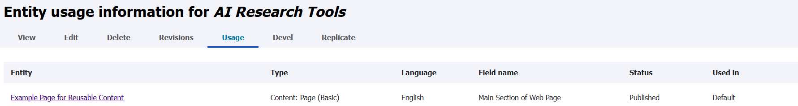

## The Problem

[In a recent post, I described some functionality to allow embedding some content within other content](/2025/embed-node/). I had designed the use of "reusable content" so that when there was repetitive content to be put into multiple pages, the editor could create just one reusable node and embed it within the other pages. If something then changed within that content, they would only need to update it once and it would affect all of the pages embedding it.

It left one problem, though: when you're editing a node of reusable content, how do you know what pages you're going to change? Even if nobody else was also embedding that reusable content somewhere and you never knew about it, do you really remember everywhere that you yourself put it a couple of years ago? Probably not.

## The Solution

I began looking into building my own solution to this problem that would probably have looked something like a view on each reusable content page to show any other pages referencing it. Then I quickly found [entity_usage](https://www.drupal.org/project/entity_usage) which explicitly supports the entity embed scenario I had, plus some more scenarios that were less essential for us but turned out to also be very useful.

### Configuration

Configuration has a long form - long enough that I don't want to include a screenshot - but is relatively simple once you break it down.

#### What Gets Tracked

First up are some options about the tracking itself:

- Which entity types should show the "Usage" tab on it?
- Which entity types should be tracked as a source of the link?
- Which entity types should be tracked as the target of the link?
- What types of connections should be tracked?

The last one includes an impressive amount of support for connections made a variety of ways, including:

- Block Field
- CKEditor Image
- Dynamic Entity Reference
- Entity Embed (that's the one I needed)
- Entity Reference
- HTML links
- Layout builder
- Link Fields
- [LinkIt](https://www.drupal.org/project/linkit)
- Media WYSIWYG Embed (Core)

Although I needed this most for the entity embed scenario, I quickly found it useful to also be able to see links between objects that are in link fields, entity reference fields, or within a CKEditor field's text whether using linkit or not.

#### Edit and Delete Warnings

The other options are about where to put warnings when editing or deleting content, so people are reminded what other unintentional impacts their actions might have.

I wish these options would let you pick by content type (bundles), not just by entity. I also wish there was a third category for "unpublishing" a page.

In my context, the arrangement I really wanted was:

- Reusable Content gets the warning for any edits and deletions.
- Other types get the warning only if they try to unpublish or delete.

Reusable Content is clear; if I'm making any edit I know it will directly impact the other pages. Even for a typo, that can be good to know. On every other type, though, if I'm just fixing a typo, I don't need to know that there's another page that is linking to this page. Many pages don't impact that relationship at all. Very rarely do I need to know that other pages are linking to this page, other than if I am going to stop it from being publicly visible in which case I would be creating a dead link.

I can't do that with the current set of options. I can show on all editing of all nodes or no editing of any node, so I had to go with none and miss out on a couple scenarios I would prefer to have it.

Other than that, though, it's a pretty nice set of options!

### The View of Usage

Based on the settings above, there is a new tab added to content, showing everywhere else that this entity is currently being referenced by other entities.

I do wish this was a view that was more easy to edit, like removing Language if it isn't a multilingual site, but the defaults aren't bad.

### The Editing and Deletion Warnings

Now that it has the tracked reference data, it can help remind you of it in relevant contexts. If you try to edit or delete a page when there was another page linking to it, you now have a way to know that.

This gives the editor some essential information. Maybe they decide to go change that other page first so that it isn't still referencing the page to be deleted, avoiding a dead link. Maybe they realize that they actually need to keep the page that you were about to delete because of the other page's reliance on it.
